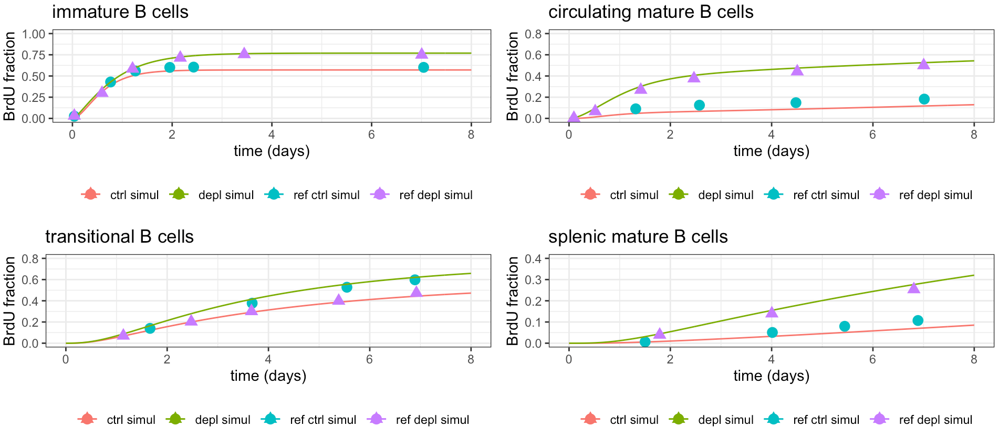
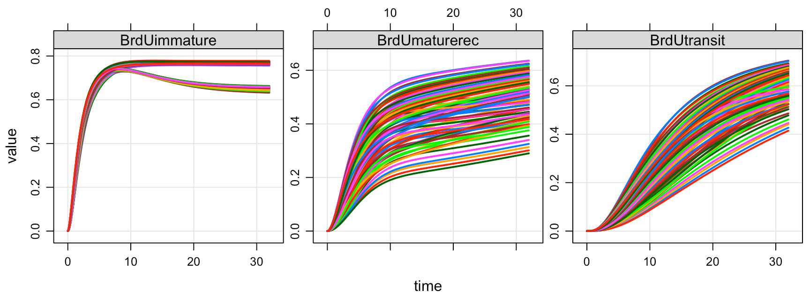

# B cell dynamics 

This model is from [Shahaf et al., 2016](https://www.frontiersin.org/articles/10.3389/fimmu.2016.00077/full). 

Influx into the system: 
0.3M per 6h; 1.2M of propreB cell influx from progenitors per day. 

## Steady State summary

| Cell type | Cell count | Ref number | 
| --------- | ---------- | ---------- |
| B cells in bone marrow | 1.61 M | 2M ([Siddique et al., 2019](https://www.nature.com/articles/s41598-019-50419-2)), 7M - 18M ([Bae et al., 2019](https://www.nature.com/articles/s41467-019-11386-4)) |
| B cells in spleen      | 38.7M  | 16 - 45M ([Hensel et al., 2019](https://www.ncbi.nlm.nih.gov/pmc/articles/PMC6524955/#:~:text=Within%20all%20the%20cell%20types,Figures%202A%2C%20%E2%80%8BB)), assuming mouse spleen has 80-90M cells ([Bae et al., 2019](https://www.nature.com/articles/s41467-019-11386-4))), 50M ([Siddique et al., 2019](https://www.nature.com/articles/s41598-019-50419-2)) | 
| B cell in circulation  | 1.16M  | 11M ([Boyer et al., 2019](https://pubmed.ncbi.nlm.nih.gov/30905737/), this data may include memory B cells and plasma cells),  4M ([Mortellaro et al., 2006](https://ashpublications.org/blood/article/108/9/2979/22537/Ex-vivo-gene-therapy-with-lentiviral-vectors))|

## Dynamics comparison

```BrdUtest.r``` aims to reproduce the figure on percentage of BrdU-labeled mouse B cells after injection with or without conditioning. 

In the original image, this is shown in grey lines. The dynamics of B cells in the different stage is captured in my simulation.




In addition, changing any parameter that modulate immature B cell dynamics (i.e. , , , ) has limited impact on the slope of immature B cell labeled ratio at the early stage, while the  has a more significant impact on the steady state. Still, these parameters all impact the rest of the system. The figure shown below scan the 4 parameters mentioned above, with +/- 50% in each parameter. The divergence in the immature B labeling ratio is driven by the halving of . 




# Content of the folder

## files

- ```Bcell_mus.cpp```. The implementation of original model

- ```Bcell_mus2.cpp```. All rates are scaled to day<sup>-1</sup>.

- ```Bcell_test.r```. This file tests the steady state of the model.

- ```Bcell_mus3.cpp```.This is implementation of BrdU labeling from Shahaf et al., 2016. Note there are some adjustment for the model: 

    1. The "-" in front of  in the equation for  is switched to "+". This is based on the model structure that  should be an efflux from . 

    2. The  in the equation for  is switched to , since this is multiplication from , rather than all the propreB cell replication. 

- ```BrdUtest.r```. This file aims to reproduce Figure 4A in [Shahaf et al., 2016](https://www.frontiersin.org/articles/10.3389/fimmu.2016.00077/full#h3).

- ```BrdU_immatureBcells.r```. This file conducts parameter scan on parameters that are related to immature B cells. 

- ```ParamEstimation.r```. This file conducts parameter optimization for labeling without depletion. 

## folders

- data (This folder contains digitized data from [Shahaf et al., 2016](https://www.frontiersin.org/articles/10.3389/fimmu.2016.00077/full#h3). See [readme.txt](data/readme.txt) for more details)
