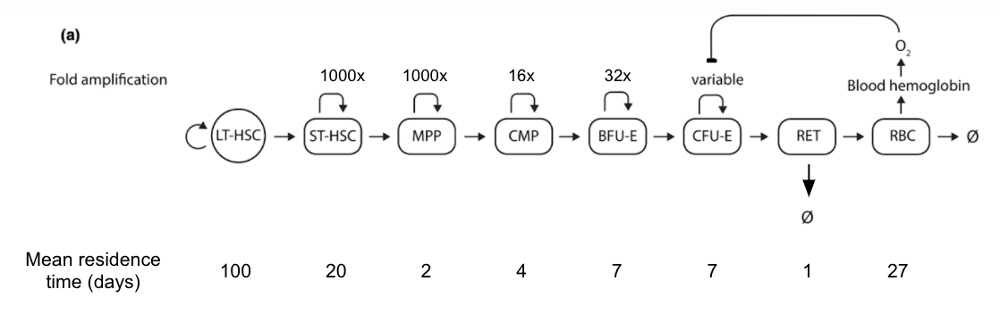

# Pyruvate kinase deficiency modeling

Pyruvate kinase deficiency (PKD) is caused by mutations in pyruvate kinase (encoded by PKLR). Since RBC lacks mitochondria, pyruvate kinase activity is essential for ATP production. Decrease in pyruvate kinase activity results in the loss of K+/Na+ balance inside RBC, change of shape of RBC, membrane lesion, and eventual cell death ([Keitt, 1966](https://pubmed.ncbi.nlm.nih.gov/5332174/), [Zanella et al., 2005](https://onlinelibrary.wiley.com/doi/10.1111/j.1365-2141.2005.05527.x)).

The disease manifestations include low hemoglobin, low RBC count, reticulocytosis; the severity of the diseases varies across different mutations and whether a patient is a homozygote ([Zanella et al., 2005](https://onlinelibrary.wiley.com/doi/10.1111/j.1365-2141.2005.05527.x), [Zanella et al., 2007](https://pubmed.ncbi.nlm.nih.gov/17360088/), [Grace et al., 2015](https://www.ncbi.nlm.nih.gov/pmc/articles/PMC5053227/)). 

## Data availability

- Human observation can be found in [Zanella et al., 2005](https://onlinelibrary.wiley.com/doi/10.1111/j.1365-2141.2005.05527.x) and [Grace et al., 2015](https://www.ncbi.nlm.nih.gov/pmc/articles/PMC5053227/). 

- Ex vivo gene therapy data on mouse can be found in [Meza et al., 2009](https://www.ncbi.nlm.nih.gov/pmc/articles/PMC2814388/) and [Garcia-Gomez et al., 2016](https://www.ncbi.nlm.nih.gov/pmc/articles/PMC5088764/). 

## Model development

Following adjustments are introduced in the model. 

- RBC lifespan. It is reduced from 120 days to 27 days ([Mentzer et al., 1971](https://www.ncbi.nlm.nih.gov/pmc/articles/PMC291977/?page=5))

- RET lifespan. It is reduced to 1 day. 

- RET death. This number is fixed at 0.01 day<sup>-1</sup>. 

All these changes are summarized in the image below. 



## Steady state summary
| readout   | value         | note          |
|---------- | ------------- | ------------- |
RBC count   | 2.5M per uL   |               |
RET count   | 285k per uL   | slightly higher than what is reported in [Zanella et al., 2005](https://onlinelibrary.wiley.com/doi/10.1111/j.1365-2141.2005.05527.x) | 
Reticulocyte, % | 11.1    | this number is higher than a mild case reported in [Mentzer et al., 1971](https://www.ncbi.nlm.nih.gov/pmc/articles/PMC291977/?page=1) | 
Hemoglobin | 9.42g/ dL | this number is similar to moderate case ([Grace et al., 2015](https://www.ncbi.nlm.nih.gov/pmc/articles/PMC5053227/)) |

## Sensitivity analysis summary

1. Reticulocyte (%) is only influenced by the lifespan of RBC; 

2. When RBC lifespan is fixed, RET death rate has limited impact on RBC count in blood. For example, when RBC lifespan  = 27 days, and RET death rate varies between 0 to 1 day<sup>-1</sup>, RBC count varies between 2.5-3M, but Hb concentration negatively correlated with RET death rate. 

3. Increase in RBC lifespan leads to higher RBC count & Hb concentration in blood;

4. To imitate a mild case of PKD, the RBC lifespan should be ~ 40 days, RET death rate ~ 0.05 days<sup>-1</sup>. See the end of ```PKD_test2.r``` double scanning plots. 


## Content of the folder

- ```PKD_test.r``` (This file tests the feasibility of using the SCD model for pyruvate kinase deficiency (PKD) with only RET and RBC lifespan tuned; numerical simulations suggest that this method does not work because decrease in RET lifespan translates into increase in RET -> RBC differentiation, which in fact, should have resulted in RET death ([Grace, 2018](https://ashpublications.org/blood/article/131/20/2183/6537/Clinical-spectrum-of-pyruvate-kinase-deficiency)))

- ```PKD.cpp``` (The model for PKD. The modulation includes 1. incorporate RET death; 2. simplify transplant; assuming only LT-HSC is being transplant. This adjustment is based on the idea that only LT-HSC will have a long-term impact after transplant; 3. remove HbS/ HbA<sup>T87Q</sup>-related terms)

- ```PKD_test2.r``` (This file tests the model in ```PKD.cpp``` and its sensitivity over the initial conditioning)

- ```readme.md``` (This read me file)


