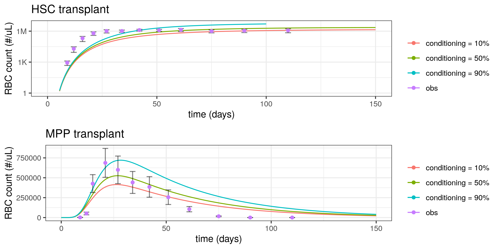
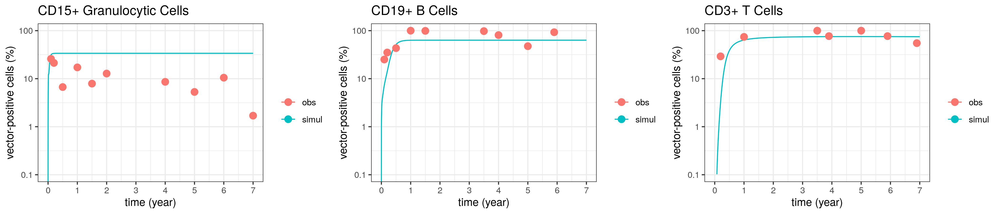

# Summary

This repo aims to develop mechanistic model for ex-vivo gene therapy, especially those related to stem cell transplant. Our models are built for either mouse or human. 

## Disease of interest

- Sickle Cell Disease (SCD). 

- -thalassemia. This disease has some similarity with SCD. Thus, we use the model from SCD with minor adjustment to predict potential treatment outcome. 

- Pyruvate kinase disease (PKD). This disease impacts the function of reticulocytes and red blood cells. The model used for this disease is highly similar to SCD model. 

- Severe combined immunodeficiency due to the lack of adenosine deaminase (ADA-SCID). Patients with this disease have impaired B cells and T cells. To predict the outcome of gene therapy on ADA-SCID, we use the model with granulocyte and lymphocyte dynamics incorporated. 

- Thromboytopenia as a side effect of ADC treatment

## Validational data

Due to the limited data that is available in the field, many result can only be validated using steady state data. However, we do have certain source to validate the cell differentiation dynamics (*human data in italic*): 

- *[Ribeil et al., 2017](https://www.nejm.org/doi/full/10.1056/nejmoa1609677): gene therapy on a patient with sickle cell disease*

- *[Thompson et al., 2018](https://www.nejm.org/doi/10.1056/NEJMoa1705342?url_ver=Z39.88-2003): gene therapy on patients with transfusion-dependent -thalassemia*

- [Boyer et al., 2019](https://pubmed.ncbi.nlm.nih.gov/30905737/): mice with stem cell/ progenitors transplant experiments. 

- [Carbonaro et al., 2012](https://pubmed.ncbi.nlm.nih.gov/22833548/): gene therapy on mice with severe combined immunodeficiency due to the lack of adenosine deaminase (ADA-SCID)

- *[Aiuti et al., 2009](https://www.nejm.org/doi/pdf/10.1056/NEJMoa0805817): gene therapy on a patient with ADA-SCID*

- Thromboytopenia as the result of T-DM1 treatment

## Method

In this repo, multiple models are presented to develop a stem cell differentiation that includes erythrocytes, lymphocytes, and granulocytes in adult human and mice. This is achieved through a number of steps: 

1. Implementation of hematopoietic cell differentiation into erythrocyte and its progenitor in human. The original model is published in [Zheng et al., 2021](https://ascpt.onlinelibrary.wiley.com/doi/full/10.1002/psp4.12638).

The verification of our implementation of Zheng model is provided on [this page](SickleCell/README.md).

2. Scaling hematopoietic cell development model from human to mouse. 

3. Incorporate dynamics of granulocytes, B cells, and T cells into mouse hematopoietic cell. The implementation of mouse B cell and T cell developmemt models are obtained from [Shahaf et al., 2016](https://www.frontiersin.org/articles/10.3389/fimmu.2016.00077/full) and [Thomas-Vaslin et al., 2008](https://www.jimmunol.org/content/180/4/2240.long), respectively. The implementations are independently verified in folder [Bcell](Bcell/) and [Tcell](Tcell/), respectively. 

4. Scaling hematopoietic cell development model from mouse to human. See [this page](mouse2human/readme.md). 

5. Add megakaryocyte development in the model.

The verification of the model was in [this page](thrombocytopenia-t-dm1/README.md). 

The combination of the model can be found [here](myeloid-refinement/model/human_ery_lymp_mk_myeloid.cpp).

6. Refine myeloid branch for neutrophil development. The model can be found [here](myeloid-refinement/model/human_ery_lymp_mk_neutrophil.cpp) with development note [here](myeloid-refinement/README.md).

## Main validations

The integrated mouse model is validated in 2 mouse studies. One from mouse stem cell/ progenitor transplants, and one from gene therapy on mouse with severe combined immunodeficiency due to the lack of adenosine deaminase (ADA-SCID). 

The erythoid mouse model (scaled down from human) is validated in mouse with stem cell and multipotent progenitor (MPP) transplants. 

The mouse model with lymphocyte and granulocyte is validated using the same stem cell, MPP, and common lymphoid progenitor (CLP) transplants carried out on mice. Overall, B cell dynamics is reasonably captured by the model, but T cell dynamics is not (more discussion on the uncertainty section).

Gene therapy on mouse with ADA-SCID provides some dyanmics data on the vector copy number (VCN) in lymphocytes after stem cell transplant. 

The integrated human model is validated in a patient with ADA-SCID going through gene therapy. 

The neutrophil development was validated using pulse-labeling data in human. 

# Setup

Detailed related to how to set up the repo is detailed in [SickleCell page](SickleCell/README.md). 

# Content of folders

- [Bcell](Bcell/) (Implementation of mouse B cell development model in mrgsolve)

- [NK_dynamics_estimation](NK_dynamics_estimation/)  (Estimation on NK cell rates in mouse. Note NK cell was not included in the final model)

- [PKD](PKD/) (Development of model to predict therapy outcome in human with pyruvate kinase deficiency)

- [Public](Public/) (This content was made public and was presented at ACoP 2023 ([poster linked](https://www.metrumrg.com/wp-content/uploads/2023/11/poster-YL.pdf))

- [SickleCell](SickleCell/) (Development and analysis of both SCD and transfusion-dependent -thalassemia models)

- [Tcell](Tcell/) (The development of naive T cell development model in mouse)

- [human2mouse](human2mouse/) (Scale HSC erythroid arm from human to mouse; incorporate lymphoid and myeloid arms to the model)

- [mouse2human](mouse2human/)  (Scale fully-integrated model from mouse to human)

- [myeloid-refinement](myeloid-refinement/) Combine megakaryocyte development with blood cell development, lymphoid development, and refine myeloid development to neutrophil dynamics; 

- [thrombocytopenia-t-dm1](thrombocytopenia-t-dm1/) Implementation of megakaryocyte development and platelet dynamics and platelet decrease as the result of T-DM1 treatment. G-CSF related content is not finished in development and should be disgarded; 

- README.md (This readme file)

