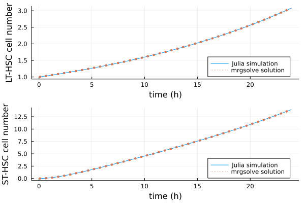

# About 

A quantitative systems pharmacology model for stem cell transplant to treat sickle cell anemia (SCD). This model is adopted from [Zheng et al., 2021](https://ascpt.onlinelibrary.wiley.com/doi/full/10.1002/psp4.12638).

## Overview

- Original purpose/ application: 
    - Quantify the impact of treatment parameters. 
    - Specially,  the initial stem cell dose, efficiency of lentiviral transduction, and degree of bone marrow preconditioning on engraftment efficiency. 

- Key conclusion(s):
    - A translational model that capture red blood cells (RBC) and hemoglobin level in healthy and SCD phenotypes. 
    - A translational model that predicts the dynamics of stem cell engraftment and RBC count after gene therapy. 

- Basic descriptions:
    - The model contains progenitor cells, reticulocytes (RET), and red blood cells (RBC). In addition, the model also includes globin synthesis and assembly in reticulocytes and red blood cells. Oxygen carried by hemoglobin imposes a negative feedback on the proliferation on progenitor cells. 
    - Size of model: 180 ODEs. 
    - Model structure as follows.

    


## Key assumptions
- Cell trafficking between bone marrow and peripheral blood is instantaneous. 
- The total number of proliferating long-term hematopoietic stem cells (i.e. LT-HSC) is a fixed number.
- Differentiation of cells is irreversible. 
- Proliferation and differentiation dynamics of progenitor cells are comparable between mouse and human. 
- Reticulocytes and red blood cells does not proliferate. 
- All the rates, e.g. proliferation rate of cells, globin synthesis rate, are constants. 
- Globin synthesis rate is linearly correspond to gene copy number. 
- The vector copy number per genome in a transduced CD34+ cell is 0.5. That is to say, for each transduced cell, there is 1 vector.
- The oxygen saturation on adult hemoglobin that carries sickle cell mutation (HbS) is 68%, healthy/ (with or without T87Q mutation) adult hemoglobin (HbA) is 74%, fetal hemoglobin (HbF) is 88%. Hemoglobin A2 (HbA<sub>2</sub>) carries no significant amount of oxygen in healthy human. 

# Prerequisites

R version 4.0.3 and the following R packages: 
- mrgsolve
- tidyverse
- gridExtra
- grid
- ggplot2
- plotly

Julia version 1.6.2 and the following Julia packages: 
- DifferentialEquations
- Plots
- CSV
- DataFrames

# Setup

## mrgsolve setup

### package management

1. Install pkgr software following the instructions [here](https://github.com/metrumresearchgroup/pkgr). 
2. Open the R project `SCD.Rproj`. This allows you to work from within a self-contained project environment.
3. Install packages by typing in terminal: `pkgr install`. This command will look for the file `pkgr.yml` and install the packages listed. The specific package versions are imported from https://mpn.metworx.com/docs/.

### mrgsolve installation
For detailed instructions on mrgsolve installation and important dependencies, follow [this link](https://github.com/metrumresearchgroup/mrgsolve). 


## Julia setup
Clone the entire repo to your local system, and then switch directory to the folder `julia`. All files should be in the same local folder and the above Julia packages should be installed and imported before running a simulation using the `runSCD.jl` script.

Alternatively, you can use the provided `Project.toml` and `Manifest.toml` to create a static environment that is an exact snapshot of the environment we used to produce the outputs in this README.md file. For this, after running julia in the main root of this local folder, enter package `Pkg` environment and issue:

```julia
activate .
instantiate
```
And, then you can run a simulation using the `runSCD.jl` script.

# Content

This application contains the following files: 

1. ```.gitignore``` (This file contains types of files that are not included in this GitHub repo)

2. ```README.md``` (This readme file)


And folders:

1. ```data``` (This folder contains clinical trial data that are digitized using [Web Plot Digitizer](https://apps.automeris.io/wpd/). For more information, read the ```readme.txt``` file in the folder. )

2. ```img``` (This folder contains images files that are used in this markdown file. )


3. ```julia``` (The ```scdODE.jl``` is the Julia file that defines the ODE model. ```runSCD.jl``` is the Julia file that runs the model. The ```.toml``` files are the snapshots of Julia environment).  

4. ```mrgsolve``` (See the ```readme.md``` file in the folder)


# Model implementation


Compare to the model described in [Zheng et al., 2021](https://ascpt.onlinelibrary.wiley.com/doi/full/10.1002/psp4.12638), we have some major changes.

1. Globin synthesis and assembly implementation. This adjustment is to match the unit in both side of the differential equation and match the fluxes in the system. Here we use <a href="https://www.codecogs.com/eqnedit.php?latex=\beta" target="_blank"></a>-globin synthesis in RET as an example. 

    In Zheng et al., 2021, the dynamics is written as 
    

    In this equation, the left side and  are mass change over time, but  and  are concentration change over time. 

    To correct this mismatch, we change the equation into 
     

    Similar changes is carried out in all the globin differential equations. 


2. Long-term haematopoietic stem cell proliferation rate. This rate is not provided in Zheng et al., 2021. The parameter used here is from [Catlin et al., 2011](https://www.ncbi.nlm.nih.gov/pmc/articles/PMC3099568/), which is 0.057 day<sup>-1</sup>.  

3. Alpha globin synthesis rate. This rate is decreased from  nmol.cell<sup>-1</sup>day<sup>-1</sup> to  nmol.cell<sup>-1</sup>day<sup>-1</sup>. 

    We tune this parameter because the simulation result based on parameters reported in Zheng et al., 2021 does not fit normal human physiology. To be more specific, the red blood cell in a normal person is ~12 trillion, half of what it is supposed to be, yet hemoglobin concentration inside red blood cell is more than twice of the normal value (~330g/L, reported in [Pittman, 2011](https://pubmed.ncbi.nlm.nih.gov/21634070/)). 

    To tune this parameter, we use 3 metrics reported in [Pittman, 2011](https://pubmed.ncbi.nlm.nih.gov/21634070/): 
        
        i.   RBC count. In healthy human, it is ~ 4 million per uL.

        ii.  Hemoglobin concentration in blood. In healthy human, it is 12 ~ 15.5g/dL. 

        iii. Hemoglobin concentration in RBC. This value should be ~ 330g/L. 

    

    Overall, when the globin synthesis rate equals  nmol.cell<sup>-1</sup>day<sup>-1</sup>, most of the observed metrics fall into the normal range. Thus, in our future implementation, we use the tuned value. 

    In addition, this change is overall in line with observed hemoglobin synthesis rate.
    In [Hibbert et al., 2001](https://www.ncbi.nlm.nih.gov/pmc/articles/PMC4457298/), the hemoglobin synthesis rate in rat is ~ 0.11-0.42mg.g<sup>-1</sup>.day<sup>-1</sup>. Assuming human has the same synthesis rate, a body of 70kg, and 240 billions of reticulocytes (number estimated based on [Koepke and Koepke, 1986](https://onlinelibrary.wiley.com/doi/pdf/10.1111/j.1365-2257.1986.tb00093.x) that number of reticulocyte is 1/100 of number of red blood cells), then human is supposed to have a hemoglobin synthesis rate of  to  nmol.cell<sup>-1</sup>day<sup>-1</sup>. By the assumption that synthesis rates between  globins are 1: 0.5: 0.03: 0.04, then the synthesis rate for -globin should be in the range of  to  nmol.cell<sup>-1</sup>day<sup>-1</sup>.
    
    In SCD patients, it is reported that Hb synthesis rate averages 0.2g.kg<sup>-1</sup>day<sup>-1</sup> ([Hibbert et al., 2014](https://www.ncbi.nlm.nih.gov/pmc/articles/PMC4084935/)). This converts to -globin synthesis rate of  nmol.cell<sup>-1</sup>day<sup>-1</sup>, close to the parameter in our implementation. 
    
    


    ## Model verification in mrgsolve

    We verify our model in 2 different settings: 
    
    1. when the system starts with only 1 stem cell. This aims to find out steady state blood cells in either healthy people or sickle cell disease patients. 

        Here is a summary table of steady state value. These values are overall in line with what is observed in human ([Hibbert et al., 2014](https://www.ncbi.nlm.nih.gov/pmc/articles/PMC4084935/)).

        |                | RBC (#/uL) | Hb (g/dL) | venous oxygen (mL/dL) | Adult hemoglobin (g/dL) |
        | -----------    | -----------|-----------| --------------------- | ---------------- |
        | Healthy person | 4.2M       | 14.1      |  13.2                 | 12.3 (HbA)       |
        | SCD patients   | 1.8M       | 7.7       |  6.6                  | 6.8 (HbS)        |

        The simulation result is as follows. 


        


    2. when a sickle cell patient goes through lentiviral-induced hematopoietic stem cell transplant, as reported in [Ribeil et al., 2017](https://www.nejm.org/doi/full/10.1056/nejmoa1609677).

    In this case, we compare 4 simulated variables with observed data after stem cell transplant: 
    
    - total RBC count
    - hemoglobin concentration, both HbS and HbA with T87Q mutation. 
    - RET count
    - Hb concentration in RBC. 

    The simulation results as well as clinical observation is shown as follows. Overall, 
    the steady states of simulation and patients are similar, though the RBC and Hb recovery dynamics is a little off. 

    - Note that the predicted total RET count (cyan line, 2nd panel) correspond well to the observed data. This indicates the model probably work well upstream of RET. 

    - Note that predicted RBC recovery is slower than the observed RBC. This might be due to blood cells proliferating faster after stem cell depletion ([Busch et al., 2015](https://www.nature.com/articles/nature14242#Sec15)). It could also be due to interference from transfused RBC the patient received prior to gene therapy. These RBCs are present for at least 3 months after gene therapy, judging by HbA level in patient blood. 

    - Note that the Hb recovery is faster in the simulation than observed. This could be explained if hemoglobin synthesis rate is not a constant, lower immediately after the transplant. This speculation is consistent with the observation that predicted Hb in RBC is higher than observed. 

    - Note that the observed HbS and HbA<sup>T87Q</sup> almost converged at the steady state. This would make sense if any of the following cases were true: 1. the VCN per genome is higher than what is assumed; 2. the conditioning strength is greater than assumed;  3. the DNA segment encodes HbA<sup>T87Q</sup> is more accessible than the DNA fragment that encodes HbS, leading to more transcription and translation of HbA<sup>T87Q</sup> than HbS in transduced cells. 


    

    ## Model verification in Julia

    We compare the simulation result from mrgsolve and Julia. In this case, we look at stem cells change (LT-HSC and ST-HSC) when the system starts with 1 hematopoietic stem cell. The simulation results from Julia and mrgsolve overlap with each other, indicating our Julia model is working. 

    

    
    ## Sensitivity analysis over preconditioning intensity

    We perform sensitivity analysis over the preconditioning intensity. The higher preconditioning intensity is, the less endogenous progenitor cells are kept before the transplant. This means that it is more likely to have a successful hematopoetic stem cell transplant, and a higher proportion of cells after transplant is ex vivo transduced cells.

    We show that at steady state (18 months after transplant), a higher preconditioning intensity is associated with a higher total RBC count and Hb concentration in blood. This suggest that maintaining a high preconditioning intensity is important for a successful treatment. 

    

    Yet, the recovery dynamics after different intensities of preconditioning indicates there is a trade off. Higher preconditioning intensity is associated with a sharper drop on both RBC count and hemoglobin concentration after HSC transplant, though followed by a quick recovery. 

    


    # Model application in predicting gene therapy results on -thalassemia patients

    We apply this model to predict the gene therapy outcome on transfusion-dependent -thalassemia. The result of clinical trials are reported in [Thompson et al., 2018](https://www.nejm.org/doi/10.1056/NEJMoa1705342?url_ver=Z39.88-2003). 

    We made adjustment as follows to accommodate difference in SCD and -thalassemia. 

    - -globin synthesis rate. In -thalassemia patients, the -globin synthesis rate is assumed to be half of normal. 

    - RBC life span. This value is assumed to be 36 days ([Singer et al., 2004](https://ashpublications.org/blood/article/104/11/3616/77963/Biotin-Labeled-RBC-Survival-in-Thalassemia-and)).

    - -globin synthesis rate in transduced cell is linearly correlated with vector copy number (VCN) per genome.  For example, if a transduced cell carries 2 vectors (i.e. VCN = 1), the synthesis rate of T87Q -globin is twice the synthesis rate of endogenous -globin.

    Simulation results shown as follows. 

    

    Further sensitivity analysis shows that the endogenous -globin synthesis rate and RBC life span has limited impact on the steady state of the concentration of HbA<sup>T87Q</sup> after hematopoietic stem cell transplant. In this case, a patient is assumed to be infused with 10<sup>8</sup> CD34+ transduced cells (VCN = 0.5) at time 0. 

    

    The steady state of these simulations have ~30% variability. This variability is lower than what is observed in clinical trial HGB 204.  


    However, we do see these 2 parameters impact the patient status before they go through gene therapy. With longer life span and higher -globin synthesis capacity, a patient is more likely to have a normal hemoglobin concentration. 

    

    Note that the sensitivity analysis shows that when patients have extremely low -globin synthesis capacity, they tend to have a higher level of blood RBC count. We believe this might be an artifact of the parameter scanning. In reality, RBC from these patients tend to have a much shorter lifespan, thus these patients still have a low blood RBC count. 


# Content of this folder

## General setup
- ```pkgr.yml``` (The project file lists the package version and source)
- ```SCD.Rprog``` (The project file that sets up the working context)
- ```README.md``` (This readme file)

## SCD model implementation, parameter tuning, and sensitivity analysis

- ```fullmodel.cpp``` (The direct implementation of model published in [Zheng et al., 2021](https://ascpt.onlinelibrary.wiley.com/doi/10.1002/psp4.12638). Note numerical instability was reported when we try to run this model)

- ```fullmodel2.cpp``` (Our version of SCD model, used in all our future implementation and testing)

- ```HSCproliferation_scan.r``` (This file looks at the parameter sensitivity of HSC proliferation rate)

- ```ParameterTuning.r``` (This script tunes the synthesis rate of alpha globin . This script is used to produce [this figure](../img/ksyn_tuning.png))

- ```Sickle_healthy.r``` (This file generates the steady state for HbAA and HbSS subjects; system starts at 1 LT-HSC. This script is used to produce [this figure](../img/healthy_sickle.png) and the summary table in the Model Verification section)

- ```S4_Ribeil2017.r``` (This file simulates ex vivo edited HSCT reported in [Ribeil et al., 2017](https://www.nejm.org/doi/full/10.1056/nejmoa1609677) and [this figure](../img/Ribeil_2017.png))

- ```SCDconditioning_scan.R``` (This file conduct the sensitivity over the conditioning intensity. This script produces [this](../img/preconditioning_steadystate_SCD.png) and [this](../img/preconditioning_recoverydynamics_SCD.png) figures)


## -thalassemia model implementation and sensitivity analysis

- ```thalassemia.cpp``` (The model for -thalassemia; modified -globin synthesis, lifespan of RBC)

- ```beta_syn_scan.r``` (Parameter scanning on the -globin synthesis rate and RBC lifespan. This script is used to generate [this](../img/sens_steadystate_RBClifespan_betasyn.png) and [this](../img/sens_treatment.png) figures)

- ```beta_thalassemia_treatment.r``` (This file simulates treatment as reported in [Thompson et al., 2018](https://www.nejm.org/doi/full/10.1056/NEJMoa1705342). This script generates [this figure](../img/thompson2018.png))


