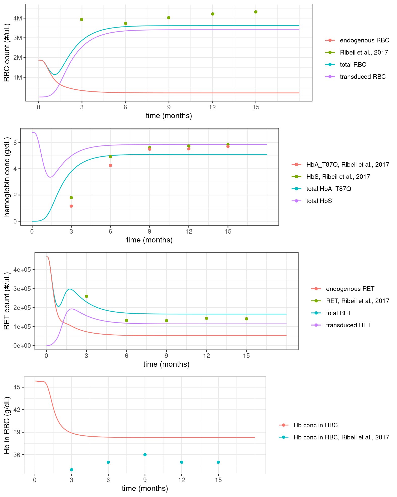

This folder host the clean up fro the mrgsolve folder; 

The fullmodel3.cpp in this folder is the cleanup of `../mrgsolve/fullmodel2.cpp` of additional branches of transduced cells. All transduced cells were merged into 1 branch, rather than have multiple. Reproducing the Ribeil et al. 2017 Figure S4 is included in the here. 

