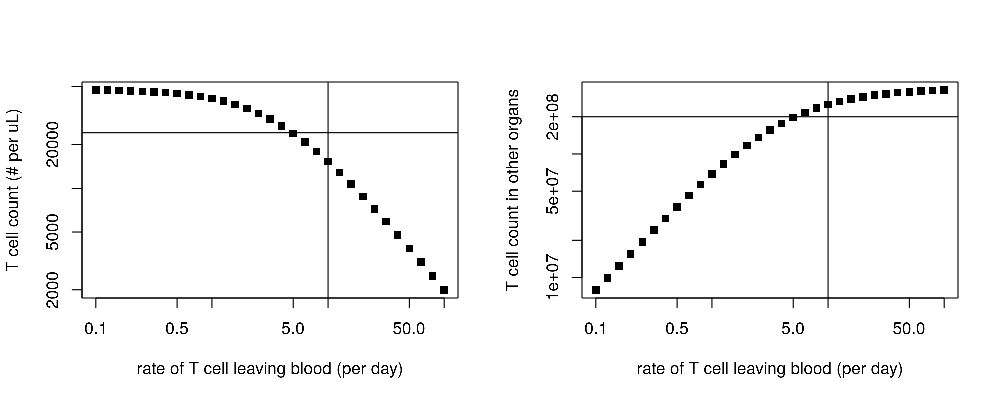
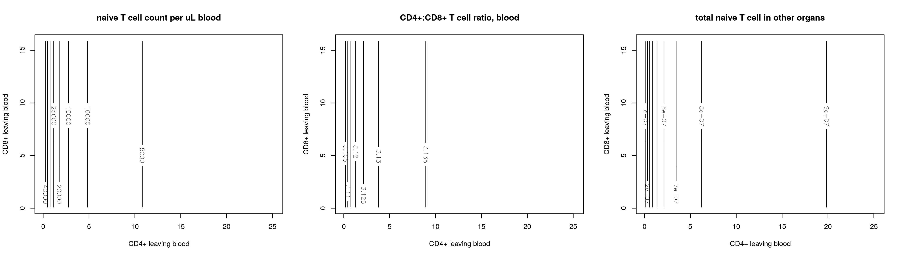

# Build T cell dynamics in mouse 

The model and parameters are taken from [Thomas-Vaslin et al., 2008](https://www.jimmunol.org/content/180/4/2240.long). 

There are 2 minor parameter adjustments, because the original paper only reported 2 digits after decimal point. 

1. , from 0.2 to 0.2029. This is the parameter that controls cell differentiation from early double positive (DP) cells to late DP cells. 

2. , from 0.99 to 0.994. This parameter controls DP cells differentiate into CD4+ cells. 

Both parameters have related terms with high power number, thus minor changes can be very influential to the final simulation results. 

# Model verification & validation

Here, we show how simulation results of thymocytes compare to 1. the original paper, and 2. other published observation. Note all the cell count are reported in millions. In addition, the terms after  in [Sawicka et al., 2014](https://www.frontiersin.org/articles/10.3389/fimmu.2014.00019/full) are standard deviations. 

| cell/ flux type | simulation |  [Thomas-Vaslin et al., 2008](https://www.jimmunol.org/content/180/4/2240.long) | [Sawicka et al., 2014](https://www.frontiersin.org/articles/10.3389/fimmu.2014.00019/full) | [Alpdogan et al., 2006](https://www.ncbi.nlm.nih.gov/pmc/articles/PMC1895735/) | [Modigliani et al., 1994](https://onlinelibrary.wiley.com/doi/10.1002/eji.1830240533)| 
| ------| ------- | ------- | ------ | ------ | ------ |
| double negative | 1.31  | 1.34  | -- | 1.44 | -- |
| double positive (DP) | 43.6  | 43.57 |  96.5  66 | 52.5|  -- |
| early stage DP | 3.25 | 3.3 |  -- | -- | -- |
| late stage DP  | 40.4 | 40.3 | -- | -- | -- |  
| CD4+  in thymus | 6.53  | 6.53  | 12.33 7.94 | 7.5 | -- |
| CD8+ in thymus  | 1.08  | 1.25 | 4.253.12 | 2.13 | -- |
|DP death | 13.9 | 14 | -- | -- | -- | 
|CD4+ thymus output | 2.39 | 2.4 | -- | -- | -- | 
|CD8+ thymus output | 0.43 | 0.5 | -- | -- | -- | 
|Total thymic output | 2.82 | 2.9 | -- | -- | 1-2 | 


Overall, it appears that our implementation of the model provides reasonable results. 

The verification of dynamics is shown as below. The points are digitized from the original paper. There is some minor level of difference, presumably due to minor changes in the parameter set, as well as the difference in the conditioning process: in the original paper, the conditioning is achieved through exponential decays and different cell populations have different decay parameters (parameters not provided); in our implementation, it is assumed that 70% of cells lost. Yet, despite the difference, the overall the trend is similar. 


# Incorpate T cell dynamics outside thymus

To couple the thymocyte model with T cell dynamics in blood, we introduce 2 other variables, CD4+ T cells in periphery blood and CD8+ T cells in periphery blood. We assume all the CD4+/ CD8+ T cells in blood does not proliferate or differentiate, and their dynamics is fully driven by thymus output and cell death ([Braber et al., 2012](https://www.sciencedirect.com/science/article/pii/S1074761312000556)). This assumption is consistent with the assumptions used in [Thomas-Vaslin et al., 2008](https://www.jimmunol.org/content/180/4/2240.long).  


## Naive T cells entering secondary lymphoid system

T cells in the periphery blood enter secondary lymphoid tissues (e.g. lymph nodes, spleen, Peyer’s patch) after being in circulation. They stay alive and move freely in these system before encounter any antigen. Naive T cells may also enter lungs, livers, and bone marrows, but in much smaller numbers ([Scollay et al., 1980](https://pubmed.ncbi.nlm.nih.gov/7379836/), [Sprent and Surh, 2002](https://pubmed.ncbi.nlm.nih.gov/11861612/)).

In our diagram, we do not specify all these tissues, but lump them together as "other organs".


The lifespan of CD4+ and CD8+ cells in blood is reported to be 31 days and 72 days, respectively ([Braber et al., 2012](https://www.sciencedirect.com/science/article/pii/S1074761312000556)).


Here we use 2 methods to model the dynamics of T cell entering secondary lymphoid organs: 

1. We assume a fraction of CD4+ and CD8+ cells are directly sequester in secondary lymphoid organs. This is the method used in [Thomas-Vaslin et al., 2008](https://www.jimmunol.org/content/180/4/2240.long) when the authors modeled T cells in spleen, one of the major secondary lymphoid organs. Different from [Thomas-Vaslin et al., 2008](https://www.jimmunol.org/content/180/4/2240.long), we assume the fractions of CD4+ and CD8+ output that goes into secondary lymphoid organs are the same. This idea is partially supported by the observation that their entering and exiting fractions into/ from lymph nodes are the same ([Tomura et al., 2008](https://www.pnas.org/content/105/31/10871.short)).

2. Directly modeling CD4+ and CD8+ cells entering secondary lymphoid system. Parameters are taken from [Jafarnejad et al., 2019](https://www.ncbi.nlm.nih.gov/pmc/articles/PMC6591205/). 


## Naive T cell exiting secondary lymphoid system

In [Mandl et al., 2012](https://www.pnas.org/content/109/44/18036), the egress rate of CD4+ and CD8+ cells from lymph nodes are reported as follows. 

| Type of T cells | peripheral LN egress rate | mesenteric LN egress rate | mean LN dwell time |
|---------------- | ------------------------- | ------------------------- | ------------------ |
|   CD4+          | 0.04-0.14 h<sup>-1</sup>  | 0.07-0.15 h<sup>-1</sup>  | 12.1h              |
|   CD8+          | 0.01-0.12 h<sup>-1</sup>  | 0.05-0.11 h<sup>-1</sup>  | 18.8h              |

We assume no proliferation or death in the secondary lymphoid organs or other organs (e.g. liver, lung, bone marrow ([Cose et al., 2006](https://pubmed.ncbi.nlm.nih.gov/16708400/))). The rate for CD4+ T cells and CD8+ T cells from secondary lymphoid organs should be the same based on the report [Mandl et al., 2012](https://www.pnas.org/content/109/44/18036) and [Tomura et al., 2008](https://www.pnas.org/content/105/31/10871.short) that the fraction of cells lost over time is the same between the 2 groups. 

We set the exit rates of T cells to be 1.2 day<sup>-1</sup>.  


## Testing and troubleshooting

We use the observation from [Scollay et al., 1980](https://pubmed.ncbi.nlm.nih.gov/7379836/) to validate the model. In this paper, T cell in the thymus were labeled and number of labeled T cells in the mouse blood were tracked over time. 

We also use some steady state mouse lymphocyte data as a sanity check. Normal mouse naive T cell count varies between 0.12-24k per uL ([Nemzek et al., 2001](https://pubmed.ncbi.nlm.nih.gov/11713907/), [O'Connell et al., 2015](https://www.ncbi.nlm.nih.gov/pmc/articles/PMC4408895/), [John Hopkins University mouse facility](https://researchanimalresources.jhu.edu/wp-content/uploads/2017/09/2017JHPhenoCoreCBCmice.pdf)). In addition, The ratio between CD4+: CD8+ cells in blood is between 2.4 and 4.8 ([Seddon and Yates, 2018](https://pubmed.ncbi.nlm.nih.gov/30129206/)), and in the lymph node is ~1.5. Furthermore, naive T cells that are in lympy nodes, spleen, liver, lung, kidney, and other organs add up to ~560M ([Cose et al., 2006](https://pubmed.ncbi.nlm.nih.gov/16708400/)).


### Method 1

When assuming the fractions of CD4+ and CD8+ cells that are sequester in secondary lymphoid organs are 80% and 80%, the dynamics of T cell in the blood is overall similar to what is reported in [Scollay et al., 1980](https://pubmed.ncbi.nlm.nih.gov/7379836/). 


However, circulating naive T cells is 47k per uL, much higher than what is expected.  


To make the naive T cell count in blood closer to normal value, we tune the rate for T cell re-entering blood circulation. 

We would also like to gauge the cells that are residing in other organs. 


When the exit rate decreased to lower than 0.0001 per day, the T cell count in the periphery blood falls drastically, getting close to normal level reported in literature (~9k in simulation); at the same time, T cells in other issues add up to 281M, more than half of what is reported in 


### Method 2

We model the naive T cell entering and leaving secondary lymphoid organs with the rate of 0.1 day<sup>-1</sup> ([Sove et al., 2020](https://ascpt.onlinelibrary.wiley.com/doi/full/10.1002/psp4.12546)) and 1.2 day<sup>-1</sup>. The dynamics is shown as follows. 


However, the steady state is similar to the previous simulation (~47k naive T cells per uL of blood), higher than what is expected in the mice. In addition, the naive T cell number in other organs are 7.2M, lower than what is expected (~560M).


Further parameter scan shows that when the rate for naive T cells entering other organs with a rate close to 10 day<sup>-1</sup>, the maximum rate used in [Sove et al., 2020](https://ascpt.onlinelibrary.wiley.com/doi/full/10.1002/psp4.12546), blood T cells is reduced to a number in the normal range, and the naive T cells in other organs is also closer to what is reported in mouse. 




After increasing the naive T cells leaving blood to enter other organs, the dynamics of T cell is as shown as follows. 


Changing the rate that dictates naive T cell re-entering periphery blood has limited impact on the dynamics of labeled T cells entering blood (see figure below),  but has a significant impact on the steady state. After dropping the rate from 1.2 per day to 0.2 per day, naive T cell count in the blood drops to 3.3k per uL, while naive T cells in other organ increases to 320M. 


A deeper parameter scan on rates of T cell leaving and re-entering periphery blood reveals that even though tuning the rate for naive T cells to leave or re-enter periphery blood may move the naive T cell count in blood and in other organs to an acceptable range, but the ratios between CD4+:CD8+ cells are off. This indicates 2 assumptions should be changed: 1. CD4+ and CD8+ cells have the same rate leaving peripheral blood; 2. no naive T cell death outside of blood. 


## Introducing different rates for naive T cells to leave periphery blood

Here, we test out the possibility if we allow CD4+ and CD8+ T cells to have different rates to leave periphery blood and enter other organs. 

Parameter scan shows that the rate for CD4+ T cell leaving blood have a dominant role on influencing the steady state of either naive T cell count in blood and in other organs. This makes sense, because thymic CD4+ output is much higher than thymic CD8+ thymic output. In contrast, the ratio of CD4+:CD8+ cells are relatively stable. 



Thus, at the later stage, we fix the rate for CD4+ naive T cells to leave peripheral blood at 10 per day. We fix the rate for CD8+ naive T cells to leave peripheral blood at 5 per day. 


## Incorporating T cell death in other organs

Here, we introduce death for naive T cells in other organs. This is partially justified that spleen is known to remove unwanted cells ([Lewis et al., 2019](https://www.ncbi.nlm.nih.gov/pmc/articles/PMC6495537/), [Moghimi, 1995](https://www.sciencedirect.com/science/article/abs/pii/0169409X95000437)).


A parameter scan on the death rates of CD4+ and CD8+ T cells shows these 2 numbers should be small, otherwise the T cell residing in other organs would be much lower than what is expected. This is consistent with parameters used in [Sove et al., 2020](https://ascpt.onlinelibrary.wiley.com/doi/10.1002/psp4.12546). Thus, we fix the death rate in other organs for CD4+ naive T cells at 0.002 day<sup>-1</sup>, for CD8+ naive T cells at 0.001 day<sup>-1</sup>. 


Simulation at steady state indicates naive T cell count in blood is 19k per uL blood with CD4+:CD8+ ratio at 2.9, and naive T cells in other organ at 282M. 


Adjusting the rate of naive T cells re-entering changes the blood T cell count with limited impact on CD4+:CD8+ ratio but can elevate T cell counts in other organs. 


Overall, the dynamics simulation preserve the trend in the observed data, but the value is about a fold higher than what is reported. This could be explained by 3 reasons: 
1. uncertainty in the fraction of thymocyte that is labeled in the experiment. The percentage of labeling reported by [Scollay et al., 1980](https://pubmed.ncbi.nlm.nih.gov/7379836/) varies between 20% and 50%; 
2. variability in mouse mononuclear cell count. The original observation is normalized to per 10<sup>5</sup> nucleated cells in blood. The observed data we used in our figure is back calculated based on an averaged nucleated cells reported in [Scollay et al., 1980](https://pubmed.ncbi.nlm.nih.gov/7379836/). However, nucleated cells in mouse blood can have 5 folds of difference ([O'Connell et al., 2015](https://www.ncbi.nlm.nih.gov/pmc/articles/PMC4408895/));
3. variability in measurement. The original blood T cell count from [Scollay et al., 1980](https://pubmed.ncbi.nlm.nih.gov/7379836/) has a +/-25% variability;

Taken all the 3 reasons into consideration, we believe the dynamics simulation recapitulates the mouse observation to an acceptable degree. 


# Content of the folder

- ```Tcell.cpp``` (The implementation of thymic part in [Thomas-Vaslin et al., 2008](https://www.jimmunol.org/content/180/4/2240.long); cell count in millions of cells, but can be changed to noraml cell count by scaling the input into DN).

- ```Tcell4.cpp``` (Thymic T cell model incorporated with T cells moving into and exiting lymphoid organs & cell count scaled to normal)

- ```Tcell5.cpp``` (Thymic T cell model incorporated with T cells moving into and exiting lymphoid organs with specific rates)

- ```Tcell6.cpp``` (Introducing naive T cell death in secondary lymphoid organs based on ```Tcell5.cpp``` with a labeled branch)

- ```Tcell_SteadyState.r``` (The main script to test T cell models at steady state)

- ```Tcell_Output.r``` (The main script to test T cell labeling dynamics)

- modelstructure.png (The assumptions used to develop blood T cell dynamics; it is referenced in this file)

- scollary1980.csv (This is the digitized Fig. 3A from [Scollay et al., 1980](https://pubmed.ncbi.nlm.nih.gov/7379836/))

- ```readme.md``` (This readme file)

# Other notes

Papers on T lymphocyte dynamics in human: [Macallan et al., 2019](https://www.sciencedirect.com/science/article/pii/S2452310019300551#bib16), [Hapuarachchi et al., 2013](https://www.frontiersin.org/articles/10.3389/fimmu.2013.00366/full). 

Leukocyte distribution in mouse: [Chen et al., 2018](https://www.frontiersin.org/articles/10.3389/fimmu.2018.01286/full). Note that this paper does not differentiate naive T cells from memory T cells.
