# Mouse hematopoietic cell dynamics

The goal of this folder is to scale down human sickle cell disease (SCD) model to mouse, and then incorporate additional cells (granulocytes, lymphocytes) to the model with validation. 

## Scale down erythrocyte dynamics from human to mouse

The graphic summary of the model is provided here. 

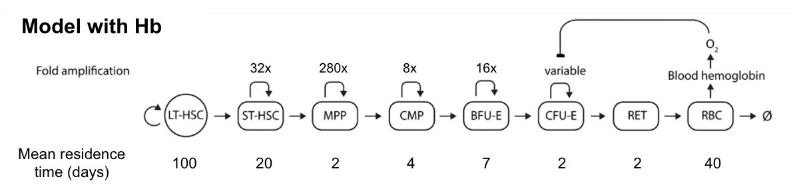

See description below for more details. 

### Adjustment on cells' mean residence time

1. Red blood cell (RBC) lifespan. it is reduced from 120 days to 40 days ([Putten and Croon, 1958](https://ashpublications.org/blood/article/13/8/789/33568/The-Life-Span-of-Red-Cells-in-the-Rat-and-the)).

2. Reticulocyte (RET) maturation time. It is decreased to 2 days from 3 days ([Ney, 2011](https://www.ncbi.nlm.nih.gov/pmc/articles/PMC3157046/)). 

3. Colony-forming unit erythroid (CFU-E) cell residence time. It is reduced to 2 days from 7 days ([Palis, 2014](https://pubmed.ncbi.nlm.nih.gov/24478716/#:~:text=Definitive%20RBCs%20in%20mammals%20circulate,nucleated%20cells%20before%20ultimately%20enucleating.)). 


### Adjustment on cell amplification/ division time

1. Short-term hematooietic stem cells (ST-HSC) and multipotent progenitors (MPP) amplification times. They are adjusted to 32 and 280 times ([Busch et al., 2015](https://www.nature.com/articles/nature14242)).


2. Burst-forming unit erythroid (BFU-E) cell amplification time. It is reduced to 16 times ([Palis, 2014](https://www.ncbi.nlm.nih.gov/pmc/articles/PMC3904103/)).

3. Common myeloid progenitors (CMP) number of division. This is estimated based on the flux from in and out of CMP. 

    - Influx. This is from MPP. Amongst all the efflux from MPP, the ratio between CMP : CLP is 1:180 (Busch et al., 2015), then we can assume ~ 114k of MPP goes to CMP per day.  
    
    - Efflux. This is based on the estimation from RBC dynamics. 
        
     Assume mouse RBC lifespan at 40 days, RBC count is 10M per uL, and with 2mL blood, then the total RBC count in mouse = 10M * 2k = 20B. Then for each day, the RBC death is 20B/ 40 = 500M. With 32 times amplification at CFU-E stage and 16 times of amplification at BFU-E stage, that means that CMP efflux to BFU-E ~800k. Then it is estimated that CMP has 3 times of division (i.e. amplification = 8). 

## Other modification

1. All transduced branches are reduced to 1. 

2. We assume the feedback impact on CFU-E dynamics and Hb saturation level in mouse are comparable to human. Two additional adjustments are listed as follow. 

    i. Volumes of RET and RBC. 
    The scaled down volume of RET/ RBC is 0.05 * 10<sup>-12</sup> L. 
    This number is calculated based on RBC diameter data reported in [Fukuda et al., 2017](https://www.ncbi.nlm.nih.gov/pmc/articles/PMC5658564/). This number is also in line with what is reported in [Raabe et al., 2011](https://www.ncbi.nlm.nih.gov/pmc/articles/PMC3189672/) and [Bollinger and Everds, 2012](https://www.sciencedirect.com/science/article/pii/B9780123820082000143). 


    ii. -globin synthesis rate. It is reduced to   nmol.cell<sup>-1</sup>day<sup>-1</sup>. The assumption is that total Hb synthesis in human, mouse, and rats are comparable; thus, Hb synthesis rate per cell in mouse is reduced because RBC cells are smaller and more numerous in mouse. 


### Simulation result

Here, we compare the simulation result from the model with or without Hb dynamics. 

Here we summarize the steady state data. Note that all data from [Bae et al., 2019](https://www.nature.com/articles/s41467-019-11386-4) are adjusted to account for the fact that its BM cells are isolated from tibia and femur, bones account for ~14% of total bone marrow cells ([Colvin et al., 2004](https://www.nature.com/articles/2403268)). We also assume that total bone marrow cell count is 500M, and bone marrow cells from tibia and femur is ~60-80M ([Swamydas et  al., 2013](https://www.ncbi.nlm.nih.gov/pmc/articles/PMC3732092/)). 

| Readout type           |    predicted number  | Ref number |
| -----------     |   --------- |  -----------  |
| RET count  (#/uL) | 479k      | 200 - 500k  ([Bollinger and Everds, 2012](https://www.sciencedirect.com/science/article/pii/B9780123820082000143)) |
| RBC count  (#/ul) |  9.5M      | 10.2M ([Fukuda et al., 2017](https://www.ncbi.nlm.nih.gov/pmc/articles/PMC5658564/)) |
| Hb conc (g/dL)   |   13.1     | 13.6 - 16.4 ([Raabe et al., 2011](https://www.ncbi.nlm.nih.gov/pmc/articles/PMC3189672/)) |
| Hb in RBC  (g/L)  |   274     | 270 - 330  ([Bollinger and Everds, 2012](https://www.sciencedirect.com/science/article/pii/B9780123820082000143)) |
| MPP               |    15k     |  75k-92k ([Bae et al., 2019](https://www.nature.com/articles/s41467-019-11386-4), [Dong et al., 2019](https://www.mdpi.com/2073-4409/8/9/951/htm))  |
| CMP               |   913k   |  755k- 3M ([Bae et al., 2019](https://www.nature.com/articles/s41467-019-11386-4), [Dong et al., 2019](https://www.mdpi.com/2073-4409/8/9/951/htm), [Busch et al., 2015](https://www.nature.com/articles/nature14242))  |
| CFU-E amplification time |    32.8 | 16-32 ([Palis, 2014](https://www.ncbi.nlm.nih.gov/pmc/articles/PMC3904103/)) |   

The discrepancy on the MPP count between simulated result and observed data may be the result that current model only tracks MPP that will differentiate into the erythroid lineage. These MPPs is ~20% of total MPP ([Pietras et al., 2015](https://www.sciencedirect.com/science/article/pii/S193459091500212X), [Wilson et al., 2008](https://www.cell.com/cell/pdf/S0092-8674(08)01386-X.pdf)). 


We then compare the dynamics of cell recovery after HSCT in mouse. Data is from [Boyer et al., 2019](https://pubmed.ncbi.nlm.nih.gov/30905737/). In this study, mice went through sublethal irradiation for conditioning. After conditioning, mice are transplanted with a fixed number of GFP-expressing progenitor cells (HSC, MPP, CMP, GMP, or CLP). Here, we focuses HSC and MPP transplant, and we use RBC recovery for comparison. 

Here, we assume the sublethal irradiation leads to 50% death of progenitor cells. 

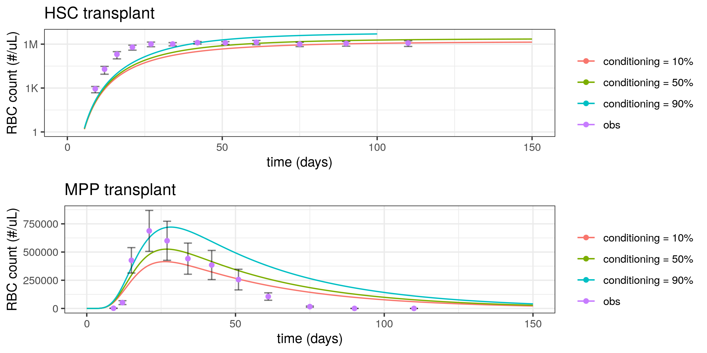

We noticed the steady state of HSCT is overall similar to reported data, though the dynamics is slower. This might be due to HSC proliferate faster after a reduction in number [Busch et al., 2015](https://www.nature.com/articles/nature14242). The rates of increase and decrease after MPP transplant looks similar to observed data, but the absolute number is off. 

At this point, we do not focus on troubleshooting the model, because the overall result is not awful, and we are more interested in building additional branches to the model. 

## Incorporate myeloid and lymphoid dynamics 

The main incentive to include lymphoid dynamics is due to our interest in adopt this model for gene therapy for immune deficiency diseases. Myeloid dynamics is included like placeholder so that the MPP count would be closer to what is observed in mice. Thus, we take very different approaches in these 2 branches: we build a coarse granulocyte differentiation model follow the map MPP -> CMP -> GMP -> granulocytes, while developing a more physiologically-based lymphoid branch. 

The graphic summary of the model is provided here. We will illustrate details in the following sections. 

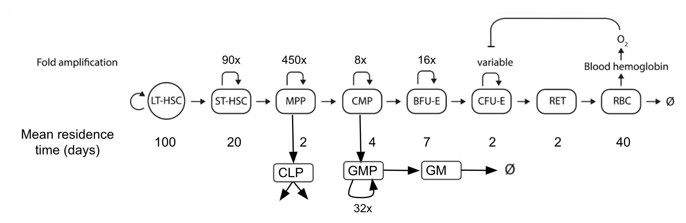

### Incorporate GMP and granulocytes

Here, we only consider 2 layers: granulocyte (GM) and its progenitor cells (GMP) ([Ferrari et al., 2020](https://www.nature.com/articles/s41576-020-00298-5)). GMP is differentiated from CMP. 

- Differentiation from CMP to GMP. This rate is estimated in [Busch et al., 2015](https://www.nature.com/articles/nature14242). It is estimated to be between 0.04 to 4 day<sup>-1</sup>. 

- Mean residence time of GMP. This is set to be 0.12 day ([Busch et al., 2015](https://www.nature.com/articles/nature14242)). 

- Turnover of granulocytes. It is indicated that, on average, GM has lifespan of 6-8 hours in mouse, monkey, and human ([Summers et al., 2010](https://pubmed.ncbi.nlm.nih.gov/20620114/), [He et al., 2018](https://www.jimmunol.org/content/200/12/4059), [Galbraith et al., 1965](https://ashpublications.org/blood/article/25/5/683/37897/Patterns-of-Granulocyte-Kinetics-in-Health)). This makes the death rate ~ 3-4 day<sup>-1</sup>. 

- Amplification at ST-HSC and MPP stages. MPP amplification round in increased from 280 to 450. This number is the upper bound of confidence interval reported in [Busch et al., 2015](https://www.nature.com/articles/nature14242). ST-HSC amplification number is increased to 90. This number is higher than the number reported in [Busch et al., 2015](https://www.nature.com/articles/nature14242). However, this might be due to [Busch et al., 2015](https://www.nature.com/articles/nature14242) and [Zheng et al., 2021](https://pubmed.ncbi.nlm.nih.gov/34139105/) uses different numbers of LT-HSC.

- Amplification from GMP to GM.This parameter assumed to be 32 because there are 4 mitotic progenitors between GMP and neutrophil, the most abundant granulocytes ([Hong, 2017](https://www.ncbi.nlm.nih.gov/pmc/articles/PMC5662779/)).

- Granulocyte count in mouse blood. This number is ~ 6k per uL ([Nemzek et al., 2001](https://pubmed.ncbi.nlm.nih.gov/11713907/)).Assuming mouse blood volume is ~ 2mL, the total number of GM in mouse is 12 millions. Note that this number may vary hugely between different mouse strings ([von Vietinghoff and Ley, 2008](https://www.jimmunol.org/content/181/8/5183)). 


### Incorporate common lymphoid progenitors

To incorporate common lymphoid progenitor (CLP), a progenitor cell that is derived from multipotent progenitor (MPP) cells, we take parameters of differentiation rate, proliferation rate, and death rate that are reported in [Busch et al., 2015](https://www.nature.com/articles/nature14242). The parameter of CLP exported to thymus is assumed based on [Zlotoff and Bhandoola, 2012](https://www.ncbi.nlm.nih.gov/pmc/articles/PMC3076003/) and will discuss later in the T cell section. 

### Incorporate B cell dynamics

The B cell model is taken from [Shahaf et al., 2016](https://www.frontiersin.org/articles/10.3389/fimmu.2016.00077/full). The implementation of this model is available in [B cell folder](../Bcell/). 

Additional 2 divisions are assumed between CLP and propreB. This number is tuned to match the cell influxes into the propreB compartments that are reported in [Shahaf et al., 2016](https://www.frontiersin.org/articles/10.3389/fimmu.2016.00077/full).

In addition, we use the parameters that is derived from progenitor depleted mice. We choose this because the sublethal conditioning results in depletion of progenitors. 

### Incorporate T cell dynamics

 The T cell is taken from [Thomas-Vaslin et al., 2008](https://www.jimmunol.org/content/180/4/2240.long). The implementation and details of verification can be found in [T cell folder](../Tcell/).


The additional amplification between CLP and double negative (DN) cells is based on the assumption that there is a round of division when CLP differentiate into early thymic progenitors (ETP), and ETPs divides 8 times in thymus before differentiate into DNs ([Seddon and Yates, 2018](https://pubmed.ncbi.nlm.nih.gov/30129206/)). Note that in our model, we omit ETP for simplicity.


The rate for CLP to be exported to thymus is unknown, presumably because this number is very small and hard to observe in experimental setting. Thus, we tune this rate to fit with observed data from 2 different source: 
1. the CLP count that exported to thymus should be ~ 10 cells per day ([Zlotoff and Bhandoola, 2012](https://www.ncbi.nlm.nih.gov/pmc/articles/PMC3076003/));
2. naive T cell count should be less than 1700 cells per uL blood at steady state ([Boyer et al., 2019](https://pubmed.ncbi.nlm.nih.gov/30905737/)); 

A parameter scaning suggests that this rate should be day<sup>-1</sup>. 


### Validation

At this stage, we focus lymphocyte branch validation, while keeping an eye on erythroid dynamics. 

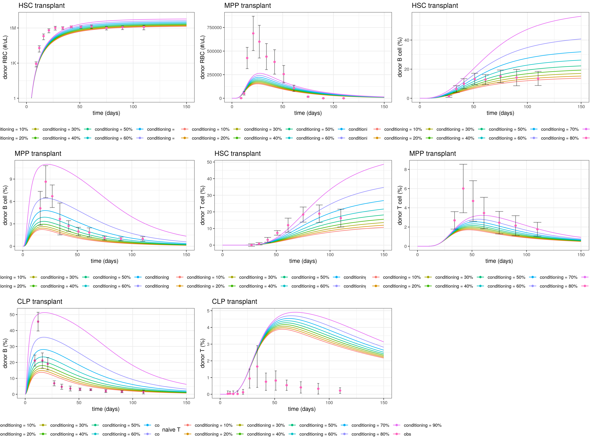

Overall, for all the HSCT experiment, there is a slower cell reconsititution than what is observed. This could be due to HSC experiences faster growth after depletion ([Busch et al., 2015](https://www.nature.com/articles/nature14242)). We will discuss this further in sensitivity analysis. 
In addition, the compensatory growth of T cell progenitors in thymus (not explicitly modeled in our current model) may also explain why T cells experience the worst recovery after transplant ([Famili et al., 2017](https://www.ncbi.nlm.nih.gov/pmc/articles/PMC5583695/)). Furthermore, there might be interindividual variability in T cell recovery because thymus environment (e.g. epithelialc cells, cytokines) are known to influence T cell development ([Velardi et al., 2021](https://www.nature.com/articles/s41577-020-00457-z)).

Overall, MPPT simulations shows the most discrpency. These could be related to the heterogeneity inside MPP population, with some of them have lineage commitment and some do not ([Pietras et al., 2015](https://www.sciencedirect.com/science/article/pii/S193459091500212X#undfig1), [Wilson et al., 2008](https://www.cell.com/cell/pdf/S0092-8674(08)01386-X.pdf)). This complexity is captured neither in MPP transplant experiment in Boyer et al., 2019 nor in our model. This may partially explain why MPPT experiments come with huge error bars. 

Moreover, progenitor cell transplant is known to have interindividual variability ([Cheng et al., 2013](https://pubmed.ncbi.nlm.nih.gov/23400432/), [Pang et al., 2011](https://pubmed.ncbi.nlm.nih.gov/22123971/)). This might also account for some of the discrepency.


Finally, the overall steady state of the cells is also consistent 
with what is observed in literature with some variability. 

| Cell type | Cell count   | Ref number | 
| --------- | ------------ | ---------- |
| MPP       |   60k        |  75k-92k ([Bae et al., 2019](https://www.nature.com/articles/s41467-019-11386-4), [Dong et al., 2019](https://www.mdpi.com/2073-4409/8/9/951/htm))  |
| CMP       |   2M         | 755k- 3M ([Bae et al., 2019](https://www.nature.com/articles/s41467-019-11386-4), [Dong et al., 2019](https://www.mdpi.com/2073-4409/8/9/951/htm), [Busch et al., 2015](https://www.nature.com/articles/nature14242))  |
| GMP       |   757k       | ~1M ([Bae et al., 2019](https://www.nature.com/articles/s41467-019-11386-4)), ~3M([Dong et al., 2019](https://www.mdpi.com/2073-4409/8/9/951/htm)) |
| GM        | 8.4k per uL  | 1.95-12.01k per uL ([Nemzek et al., 2001](https://pubmed.ncbi.nlm.nih.gov/11713907/))  |
| RET       | 498k per uL  | 200 - 500k  ([Bollinger and Everds, 2012](https://www.sciencedirect.com/science/article/pii/B9780123820082000143)) |
| RBC       | 9.9M per uL  | 10.2M per uL ([Fukuda et al., 2017](https://www.ncbi.nlm.nih.gov/pmc/articles/PMC5658564/)) |
| Hb conc   | 13.2g/dL     | 13.6 - 16.4g/dL ([Raabe et al., 2011](https://www.ncbi.nlm.nih.gov/pmc/articles/PMC3189672/)) |
| Hb in RBC | 261g/dL      | 270-330g/dL  ([Bollinger and Everds, 2012](https://www.sciencedirect.com/science/article/pii/B9780123820082000143)) |
| lymphocyte | 1.8k     | 0.12 - 24k ([JHU mouse facility](https://researchanimalresources.jhu.edu/wp-content/uploads/2017/09/2017JHPhenoCoreCBCmice.pdf)) |

Potential discrepancy between simulated data, and between data reported in different literatures could be due to difference in experimental procedure, mouse strains, and age. 

### Sensitivity Analysis

We are interested whether changes in the number of progenitor cells may impact the recovery dynamics. This interest is stemmed from 2 ideas: 

1. Lineage commitment/bias by progenitor cells. This is briefly discussed before. With out current model, we cannot address this directly, as we treat each level of progenitors as homogenous population. However, we can compensate by changing the total of progenitors being transplanted. 

2. Experiment quality. During the transplant experiment, there might be cell miscounting or dead cells being counted as live progenitors. We want to know how much impact this might have on the result. 

Thus, we perform a parameter scan on the total number of HSC/ MPP/CLP being transplanted. 

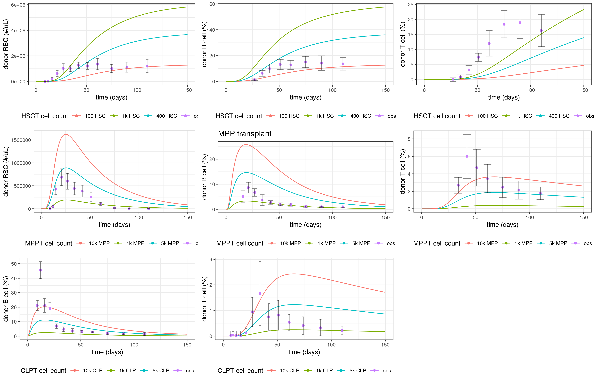

We can see the change in absolute number of progenitors can impact the amplitude or steady states of cell reconstitution, but has limited impact on temporal readouts, such as when the dynamics peaks. This implies that some parameters that dictate the temporal dynamics requires further adjustment to fully recapture the observation. 

Here, we use MPP transplant as an example, to see what parameters drive the exposure of percentage of transplanted B and T cells in blood. To achieve this goal, we use global sensitivity analysis. 

For B cells, the parameters that have the most impact are the rate CLP->proB and CLP proliferation rate. 

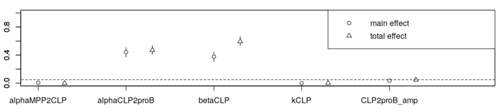

For T cells, the parameter that have the most impact is CLP proliferation rate. 

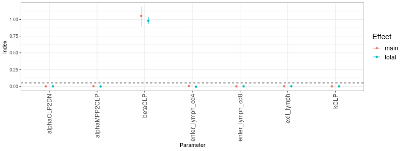

This also holds true for CLP transplant. Global sensitivity analysis shows that CLP proliferation rate impacts the timing of when the percentage of transplanted T cell peaks. 

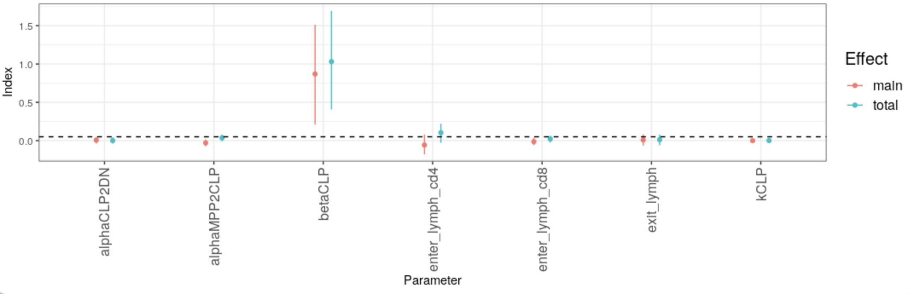

Overall, all the global sensitivity analyses show that CLP proliferation should have a big impact on the timimg when the percentage of transplanted cells peak. However, local sensitivity analysis shows that the time for transplanted cell to peak moves little unless CLP proliferation rate (betaCLP) changes a lot. Overall, these results suggest that changing parameters between CLP and thymic T cells do not have major effects when transplanted T cell percentage peaks. 

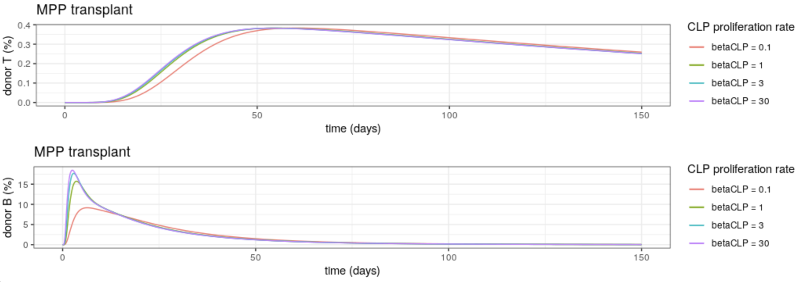

In addition, we show that adjusting rates of either CLP export to thymus has no impact on the dynamics of transplanted T cells percentage. 

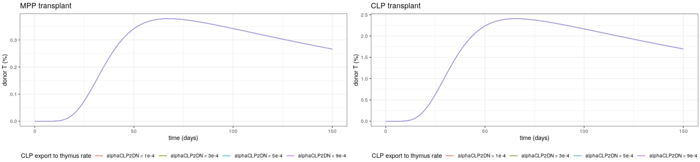

Thus, we decide to move on to focus on parameters in thymic T cell development. In this case, we adjust double negative cell proliferation and differentiation rates (each ~50%), as well as thymic progenitor cell death rate. After adjusting these 3 rates, the timing of tranplanted T cell peaks is more or less consistent with what is observed in experimental data. Additional variability may be explained by the variation in cell number involved in transplant. 

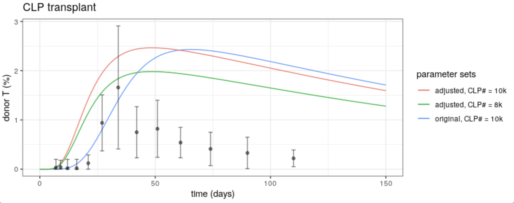

Introducing variability in progenitor proliferation, differentiation, death, and number of cells used for transplant allows the simulation to have a better match in timing. 

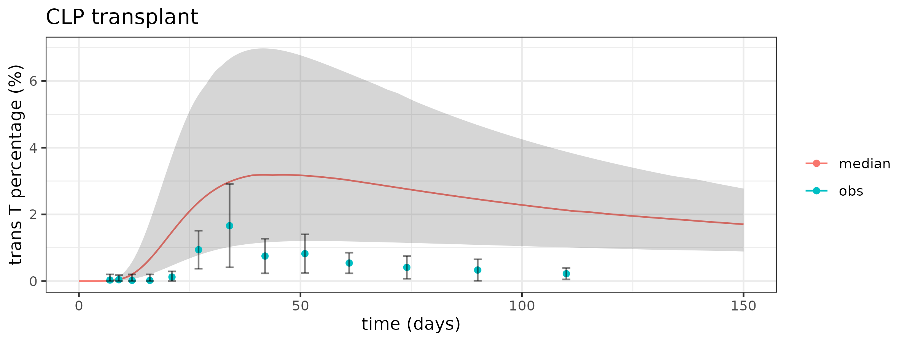

In the example, we allow 20% variation of DN proliferation & differentiation rate, as well as CLP cell count for transplant; 40% std of DN/ DP/SP death rate. 


These parameter adjustments can be justified by the difference between FVB mice (animals used in [Thomas-Vaslin et al., 2008](https://www.jimmunol.org/content/180/4/2240.long)) and C57BL/6J mice (animals used in [Boyer et al., 2019](https://pubmed.ncbi.nlm.nih.gov/30905737/)). For example, lymphocyte count in C57BL/6J mice averages ~4k per microliter of blood; in FVB mice, the count is 1-2k per uL blood, and with significant gender difference. Overall, all immune cells (neutrophil, WBC, etc) counts are higher in C57BL/6J mice ([Modigliani et al., 1994](https://onlinelibrary.wiley.com/doi/10.1002/eji.1830240533)).

Overall, this adjustment improves the simulation result on T cells in CLP transplant experiment, but it has little impact on other simulation outcomes. However, this does result in a lower T cell count. This can be remedied by tripling the rate of CLP export to thymus.


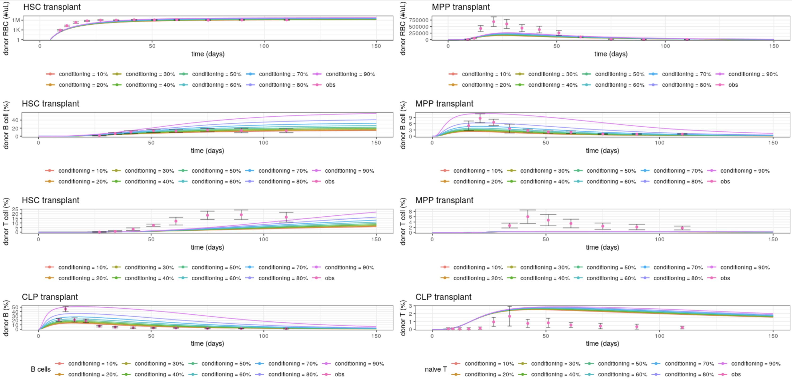

| Cell Description | Original      | Adjusted   | Re-adjusted  |
| ---------------- |:-------------:| :--------: | :----------: |
| CLP exported to thymus per day | 3.78 | 3.78 | 11.31 | 
| thymic output    | 134k per day   | 44k per day| 133k per day |
| blood T cell count | 1.7k per uL | 564 per uL | 1.7k per uL | 
| naive T cells outside thymus and blood | 24.1M | 7.9M | 23.7M |
| lymphocyte count | 1.8k per uL   | ~700 per uL| 1.8k per uL |

## Adapting mouse model for younger mice

Our eventual goal is to adapt our model for Adenosine deaminase deficiency Severe combined immunodeficiency (ADA-SCID) mice, and observe how well gene therapy works for these mice. One challenge is that many experiments are carried out on mice that are 14-18 days after birth to avoid potential systematic complications from the disease or before mice die. 

However, in these very young mice, their naive T cell dynamics are different. They have higher thymic output and a more lymphoid-based stem cell population with lymphoid progenitors that probably proliferates faster or has less death ([Young et al., 2016](https://www.ncbi.nlm.nih.gov/pmc/articles/PMC5068232/), [Baran-Gale et al., 2020](https://elifesciences.org/articles/56221)). In addition, they may also have additional source of lymphocytes ([Kumar et al., 2008](https://www.jimmunol.org/content/jimmunol/181/11/7507.full.pdf),[Rudd, 2020](https://www.ncbi.nlm.nih.gov/pmc/articles/PMC7369171/)). 

Sensitivity analysis shows that the steady state peripheral blood T cell concentration is not sensitive to DN/ DP cell proliferation rate (data not shown). Thus, for simplicity, we tune the rate of MPP -> CLP. We use the CD4+ thymocyte as the benchmark. In prior simulation, this number is ~ 300k. In 15-day mice, it is ~780k ([Lee, 2018](https://theses.gla.ac.uk/31002/)). In addition, splenic B cell count is ~25.2M ([Blackburn and Kellems, 2005](https://pubmed.ncbi.nlm.nih.gov/15705418/)).

Our parameter scanning suggests that increasing MPP->CLP rate by 2.5-3.5 folds can address the discrepancy in steady state lymphocyte count between a 15-day mouse and 3-month old mouse. 

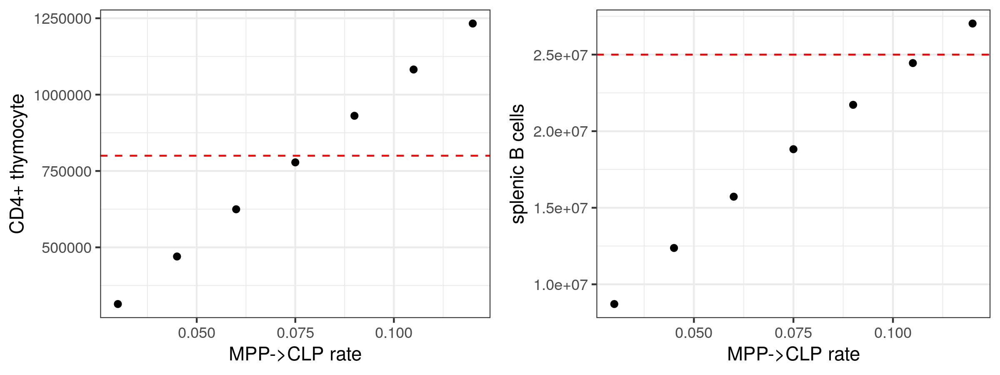

By choosing to increase MPP->CLP rate by 3 folds, lymphocytes at steady state have higher counts. 

| Mouse | naive T per uL blood |  naive B per uL blood |
| ----- | -------------------- | --------------------- |
| young | 5.3k                 | 325                   |
| adult | 1.7k                 | 130                   |


## Adapting mouse model for Adenosine deaminase deficiency Severe combined immunodeficiency (ADA-SCID) mouse

ADA-SCID is caused by mutations in adenosine deaminase (ADA), an enzyme that is important for dADP, dATP degradation in cells. Lack of ADA results in dADP, dATP accumulation and toxicity to cells. ADA is universally expressed, but most active in lymphocytes ([Flinn et al., 2018](https://ojrd.biomedcentral.com/articles/10.1186/s13023-018-0807-5)).

ADA-SCID manifestation in mice includes abnormal thymocyte. Double positive (DP) cells have increased apoptosis, though dynamics of DN cells appears to be fine ([Whitmore and Gasper, 2016](https://www.frontiersin.org/articles/10.3389/fimmu.2016.00314/full)). In addition, the apoptosis and distribution of peripheral T cells appear to be normal in ADA-SCID mice ([Apasov et al., 2001](https://www.ncbi.nlm.nih.gov/pmc/articles/PMC209335/)). 
 
ADA-SCID also leads to impairment in B cell development. The most prominent phenotypes are on activated B cells, while mature naive B cells in the spleen have a higher death rate ([Whitmore and Gasper, 2016](https://www.frontiersin.org/articles/10.3389/fimmu.2016.00314/full), [Blackburn and Kellems, 2005](https://pubmed.ncbi.nlm.nih.gov/15705418/), [Aldrich et al., 2003](https://www.jimmunol.org/content/jimmunol/171/10/5562.full.pdf), [Prak, 2012](https://www.ncbi.nlm.nih.gov/pmc/articles/PMC3366416/)).

Thus, for our adaption, we focus on adjusting DP thymocyte and naive splenic B cell death rates. 

To determine DP thymocyte death rate, we use percentage of DN cells amongst thymocytes as the benchmark. We choose this because there seems to be lots of variation on absolute progenitor/ lymphocytes counts and mouse phenotype ( [Blackburn and Kellems, 2005](https://pubmed.ncbi.nlm.nih.gov/15705418/), [Blackburn et al., 1998](https://www.jbc.org/article/S0021-9258(17)47085-2/pdf), [Blackburn et al., 2000](https://rupress.org/jem/article/192/2/159/30028/Metabolic-Consequences-of-Adenosine-Deaminase), [Morreti et al., 2021](https://www.nature.com/articles/s41598-021-02572-w)). 

In control mice, DN cell is less than 5% of total thymocytes; in ADA-SCID mice, it is ~ 20% ([Morreti et al., 2021](https://www.nature.com/articles/s41598-021-02572-w)). Parameter scanning shows that DP death rate should be increased to 2 per day. 

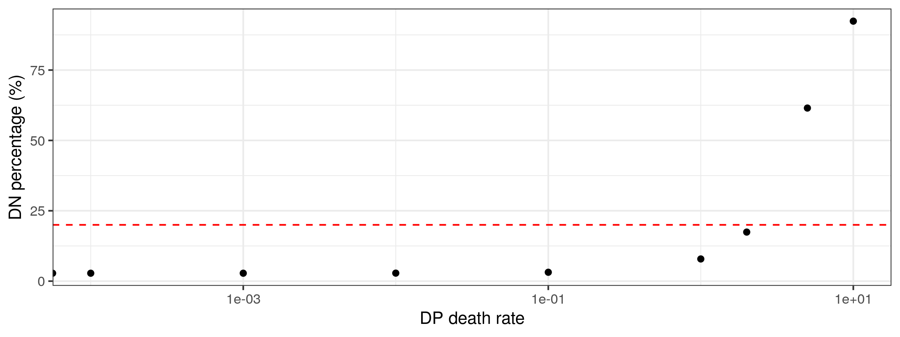

To determine splenic mature B cell death rate, we use splenic B cell count. In ADA-SCID mice, splenic B cell count is ~ 4M. Parameter scanning indicates that splenic mature B cell death rate should be increased from 0.032 per day to 0.15 per day. 

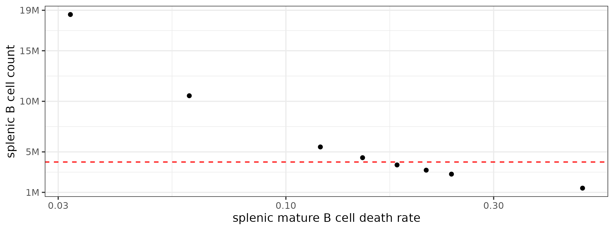

Steady state lymphocyte in periphral blood has a significant drop in ADA-SCID mouse model. This number is more overall similar what is observed in [Blackburn et al., 1998](https://www.jbc.org/article/S0021-9258(17)47085-2/pdf).

| Mouse    | lymphocytes        |
| -------- | ------------------ |
| control  | 5.6k per uL        |
| ADA-SCID |   776 per uL       |

## Simulation ex-vivo gene therapy on ADA-SCID mice. 

In [Carbonaro et al., 2012](https://pubmed.ncbi.nlm.nih.gov/22833548/), ex-vivo gene therapy is performed on mouse that are either on enzyme replacement therapy (ERT) or not. However, we choose to focus on mice on ERT, as study shows that they are almost normal immune system ([Morreti et al., 2021](https://www.nature.com/articles/s41598-021-02572-w)). 

In [Carbonaro et al., 2012](https://pubmed.ncbi.nlm.nih.gov/22833548/), authors isolated bone marrow cells from donor mice, transduced the cells with VCN = 0.99 +/- 0.76 (i.e. average vector copy number per cell is 0.99) before infusing 5M cells back to a receiver mouse.

### Gene therapy simulation
We assume the conditioning of 200cGy leads to 30% loss of all dividing/ differentiating progenitors, except thymocyte loss at 80%. Fractions of each progenitor cells in transplanted bone marrow cells is estimated based on steady state bone marrow composition. Note this method has flaws: not all the cells in the bone marrow/ thymus are progenitors or are included in the model. We also assume the conditioning strength is uniform across different progenitor populations. 

Overall, the simulation result is consistent with early data, and timing for zenith and nadir of VCN are overall consistent with observed data. In addition, steady state data is also consistent with observed data. 

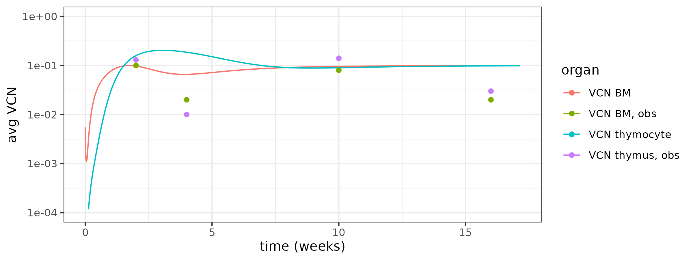

### Sensitivity analysis

We first show that conditioning strength has limited impact on the timing of peak/ nadir of VCN in bone marrow (BM) cells and thymocytes, but influences the steady state and the rate for VCN change. 

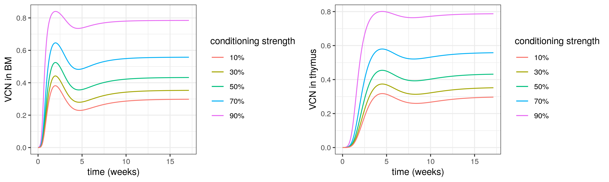

In addition, we also show that fraction LT-HSC amongst all transplanted BM cells does not impact the early dynamics of VCN in BM/ thymocytes.

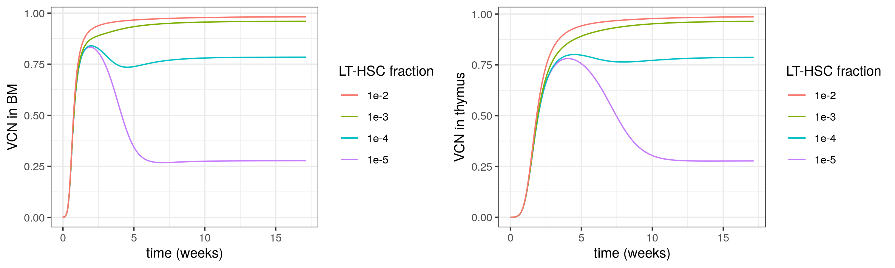

Furthermore, we test out what would happen if progenitors in thymus have a different conditioning strength comparing to those in the bone marrow. We test out this in our sensitivity analysis because we speculate radiation-based conditioning may impact cells in different organs differently. When we fix the conditioning strength for the bone marrow cells but vary the conditioning strength for thymocyte, the timing for the lowest VCN in thymus does not change, but the peak time and amplitude do change. The higher conditioning strength is, the earlier the VCN peak shows up with a higher number. 

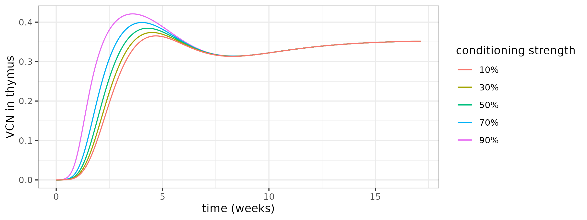

# Content of this folder

## Files

- ```readme.md``` (This readme file)

- ```erythrocytes.cpp``` (HSC differentiation model scaled from human to mouse, blood cell and their progenitors only)

- ```erythrocytes_Hb.cpp``` (HSC differentiation model scaled from human to mouse; both cell and hemoglobin dynamics are included)

- ```erythrocytes_Hb_lymphoid_myeloid.cpp``` (```erythrocytes_Hb.cpp``` model with myeloid and lymphoid lineages incorporated)

- ```transplant_function.r``` (Transplant function script that supports all simulations, global and local sensitivity analysis)

- ```LoadObs.r``` (This script loads observed data from Boyer et al., 2019)

- ```Depleted_B.r``` (This script loads depleted parameters for B cell model reported in Shafah et al., 2016)

- ```HSCT_*.r``` (Main script to test erythrocytes models defined by ```erythrocytes_*.cpp``` using HSC/MPP transplant data in mouse)

- ```GlobalSens_*.r``` (Global sensitivity analysis for B/T cells)

- SobolData_*.rds (Saved data from 2 global sensitivity analysis script)

- ```LocalSens*.r``` (Local sensitivity analysis)

- ```RandomSimul.r``` (Simulation with random effects. Generate figure in img/T_adjusted2.png)

- ```fullmodel_ada.cpp``` (Model adapted for ADA-SCID simulation)

- ```ADAtest.Rmd``` (Simulation and sensitivity analysis for ADA-SCID mouse)

## Folders

- img (where output image files are saved)

- MouseData (Validation data from mouse experiments; see readme.txt in the folder for more details)
