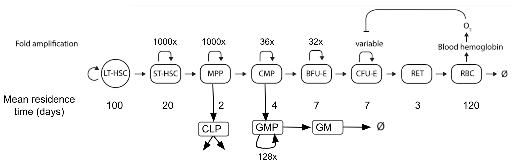
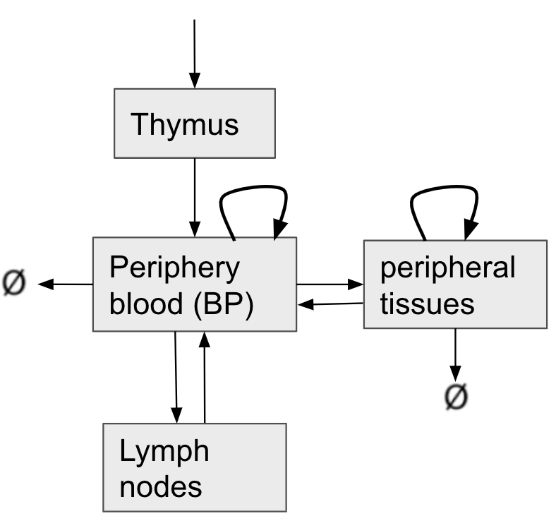
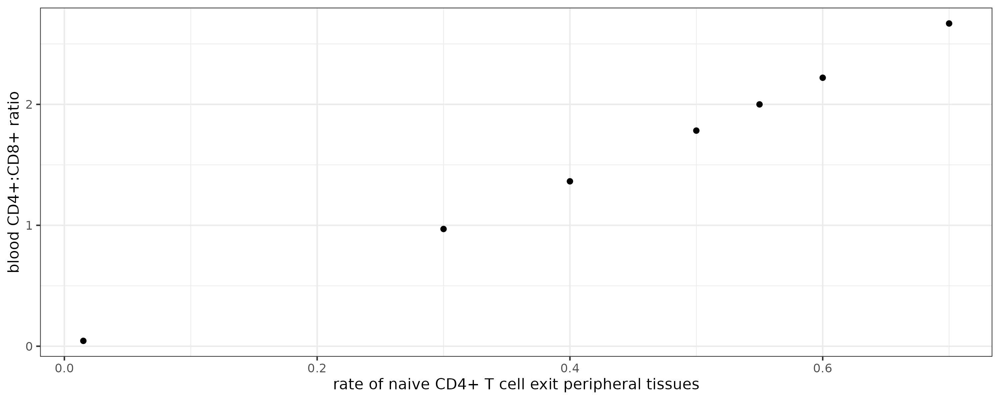
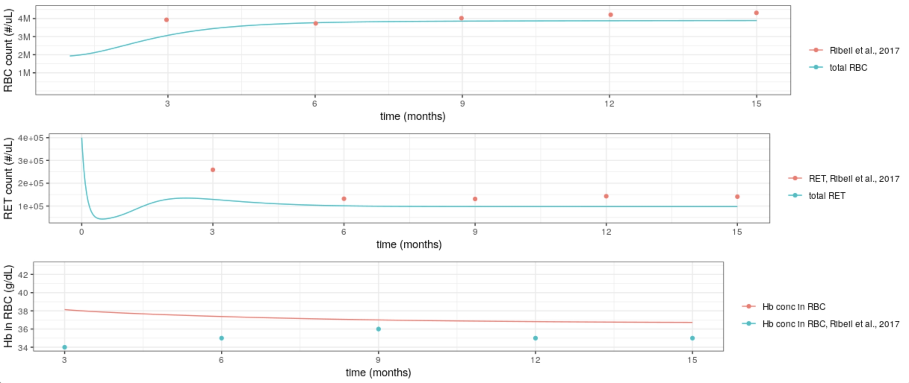
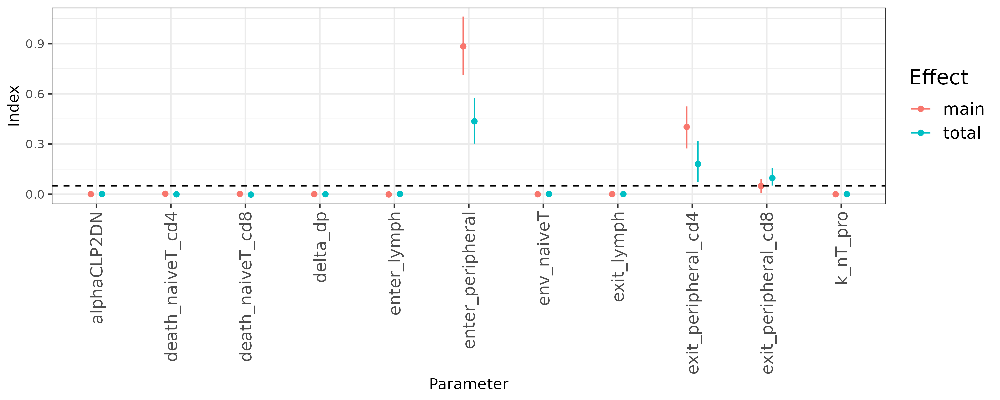
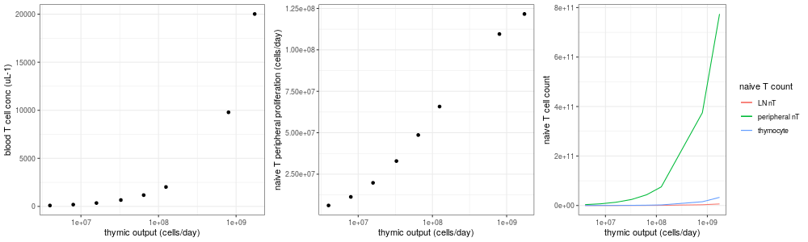

# Scale HSC differentiation model from mouse to human

Here, we aim to discuss how we scale the mouse HSC differentiation with myeloid and lymphoid lineage back to human. 

Overall, we revert the model on cell amplification round, mean residence time, and cell volume back to human. We adjust CMP amplification time from 16 to 36 to compensate cells being diverged to myeloid lineage. 



## Scale myeloid lineage from mouse to human

We increase GMP amplification number from 32 to 128 to compensate more granulocytes death in human. 

## Scale B cell dynamics from mouse to human

Since it is almost impossible to directly measure the rates of B cell development in human, while the cellular processes are fairly comparable between these two species ([Carsetti et al., 2004](https://pubmed.ncbi.nlm.nih.gov/14962195/), [Ghia et al., 1998](https://pubmed.ncbi.nlm.nih.gov/9785673/)), we keep most of the mouse parameters with a significant adjustment on the capacity of bone marrow hosting B cells. We scale it by linear scaling the capacity based on cell count of bone marrow between mouse and human. 

In mouse, the total bone marrow has ~500M cells. In human, the cell density is 0.4M per uL ([Mulder, 1974](https://academic.oup.com/ajcp/article-abstract/61/2/199/1770391?redirectedFrom=PDF)), with the volume ~1.75L ([Hassan and El-Sheemy, 2014](https://www.ncbi.nlm.nih.gov/pmc/articles/PMC1079613/#:~:text=An%20adult%20weighing%2070%20kg,haemorrhage%20it%20can%20increase%20sixfold.)), we estimate the total cellular count in human bone marrow ~700B. In mouse, the B cell progenitor hosting capacity in bone marrow is 6M, thus, human capacity should be 8.4B. 

In addition, we also increase propreB cell proliferation, as human B cell progenitor is observed to proliferate faster in vitro than after being transplanted into mouse ([Kraus et al., 2013](https://pubmed.ncbi.nlm.nih.gov/24379121/)).

## Scale T cell dynamics from mouse to human

One of the major difference between mouse and human naive T cell dynamics is their proliferation in peripheral tissue and blood is important for naive T cell maintenance in human ([Famili et al., 2017](https://www.ncbi.nlm.nih.gov/pmc/articles/PMC5583695/), [Spits, 1994](https://pubmed.ncbi.nlm.nih.gov/8011206/)). Thus, we introduce these proliferation mechanism while keep most of the rates in T cell development in thymus the same as [Thomas-Vaslin et al., 2008](https://www.jimmunol.org/content/180/4/2240.short). 

Overall the model structure is shown as follows. Major adjustments are

  + Separate lymph nodes from other tissues. We also allow naive T cells to enter peripheral tissues and lymph nodes with different rates. 
  + Introduce naive T cell proliferation in peripheral tissues and blood.
  + Introduce naive T cell death in peripheral tissues. 
  + No naive T cell death in lymph nodes.
  + Universal death rate for naive T cells (either CD4+ or CD8+) in blood or other peripheral tissues. Note we that we tune CD8+ and CD4+ death rates.
  + CD4+ and CD8+ naive T cells have different rate leaving peripheral tissues. 

  
In addition, amplification number of CLP after exported to thymus is increased a fold to compensate human size.




All the T cell dynamics rate outside thymus is taken from [Sove et al., 2020](https://ascpt.onlinelibrary.wiley.com/doi/10.1002/psp4.12546). Note one issue is that this paper does not have rates for CD4+ naive T cells, so we mostly use CD8+ naive T cell rates, except the rate for naive CD4+ cells leaving peripheral tissues. This value is tuned to make the CD4+:CD8+ ratio in blood ~ 2 ([Benjamin et al., 2018](https://www.sciencedirect.com/science/article/pii/B9780323401395000838)). 



# Model validation

We start with a steady state validation. 

|    | simulated | observed |
|----|-----------|----------|
| RBC count (per uL) | 3.9M | ~4M ([Pittman, 2011](https://pubmed.ncbi.nlm.nih.gov/21634070/)) |
| Hb (g/dL) | 13.2 | 12-15 ([Pittman, 2011](https://pubmed.ncbi.nlm.nih.gov/21634070/)) |
| Hb in RBC (g/dL) | 366 | ~330 ([Pittman, 2011](https://pubmed.ncbi.nlm.nih.gov/21634070/)) |
| T cell count (per uL) | 662 | 1243 ([Alamooti et al., 2010](https://onlinelibrary.wiley.com/doi/full/10.1002/cyto.a.20912), note this number is not naive T cell specific) |
| Thymic output (per day) | 32M | 10M - 2700M ([Bains et al., 2009](https://www.jimmunol.org/content/183/7/4329.long)), note the high thymic output happens in infancy |
| B cell count (per uL) | 137 | 101 ([Perez-Andres et al., 2010](https://onlinelibrary.wiley.com/doi/full/10.1002/cyto.b.20547)) |
|Granulocyte count (per uL) | 1.2k | 1-8k ([Yazdi, 2021](https://labs.selfdecode.com/blog/granulocytes/#:~:text=infections%20%5B27%5D.-,Granulocytes%20Normal%20Range,microliter%20(%C2%B5L)%20of%20blood.)) |


We use data from [Ribeil et al., 2017](https://www.nejm.org/doi/full/10.1056/nejmoa1609677) for validation as well. 


The validation on blood cell recovery is similar to what we discussed before. Note that the early recovery discrepancy with RBC might be related to the patient's prior infusions. We do not have data on these infused red blood cells. 



In addition, our model predicts that the patient should achieve neutrophil engraftment by day 36 after the therapy. This number is reported to be 38 days in [Ribeil et al., 2017](https://www.nejm.org/doi/full/10.1056/nejmoa1609677).

We don't think the immune recovery of this patient is useful to validate our model based on 2 reasons: 
- 1. The patient's spleen is removed prior to the gene therapy. This renders changes in both T cell and B cell dynamics.
- 2. The patient had multiple infection after leaving the hospital. This probably impacted the dynamics of granulocytes. 

# Sensitivity analysis

We look at how different parameters influences T cell dynamics. 

We use the steady state T cell count in blood as the readout to gauge what parameter in T cell development and distribution imapcts the steady state T cell count the most. Global sensitivity analysis reveals that parameters related to T cell dynamics in peripheral tissues are the most influential. 



In addition, when the thymic output is low, the impact on T cell count is less significant than peripheral T cell proliferation, which is consistent with literature ([Braber et al., 2012](https://pubmed.ncbi.nlm.nih.gov/22365666/)).



# ADA-SCID model adaption

Similar to the rest of mouse model, we use the death rates of DP thymocytes and splenic mature B cells in this model. 

In this simulation, blood T cell and B cell counts are 149 and 61 per uL. The T cell count is very close to the patient that is not treated with PEG-ADA in [Sauer et al., 2012](https://www.ncbi.nlm.nih.gov/pmc/articles/PMC3366410/), but the B cell count is significant higher. 


# Ex-vivo gene therapy for ADA-SCID patient

Data source for this simulation is from [Aiuti et al., 2009](https://www.nejm.org/doi/pdf/10.1056/NEJMoa0805817). In our simulation, we focus on patient #1 because it has no prior treatment or adversal event during the therapy. 

We assume this patient's body weight is ~7.6kg, based on the patient's gender and age. This translate into a total number of infused CD34+ cells ~65M. 

The simulation recapture the recovery of granulocytes, B cells and T cells. 


# Content of this folder

## Files

- ```readme.md``` (This readme file)

- ```erythroid_lymphoid_myeloid.cpp``` (Model scaled up from mouse to human)

- ```scd_fullmodel.cpp``` (sickle cell disease model for human with immuno cells)

- ```Test.Rmd``` (Main file to test the model and global sensitivity analysis)

## Folders

- img (where output image files are saved)

- data (source data from publications)
