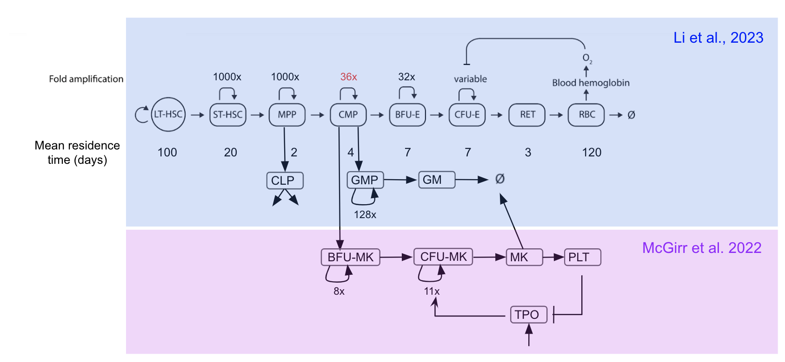
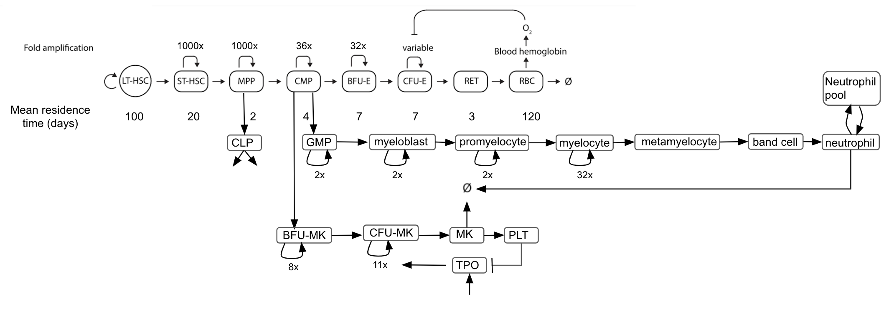

# Haematopoiesis

(add summary last)

This is further development of the prior haematopoiesis models. 

# Combining megakaryocyte branch to haematopoiesis

The base model for haematopoiesis to RBC, T cells, B cells, and granulocytes was obtaiend from [Li et al., 2023](https://www.metrumrg.com/wp-content/uploads/2023/11/poster-YL.pdf) (repo [here](https://ghe.metrumrg.com/yuezhel/ex_vivo_gene_therapy); referred as the platform model). The model for megakaryocyte development in human was obtained from [McGirr et al., 2022](https://www.appliedbiomath.com/our-science/mechanistic-model-adc-induced-thrombocytopenia-predicting-therapeutic-index). The link between these 2 models at the common myeloid progenitor cells (CMP), with the megakaryocyte (MK) branch added to the existing platform model (Diagram in Figure 1). This process was straightforward. The comparison between simulation outcomes at steady states and reference level was included in Table 1. 

<table>
  <tr> <td> Figure 1. Diagram for haematopoiesis to RBC, T cells, B cells, granulocytes, and megakaryocytes. </td> </tr>
  <tr> <td>  </td> </tr>
</table>

<table>
    <tr> Table 1. Simulation results of base model + MK branch. </tr>
    <tr>
        <th>Variable</th> 
        <th>Prior simulation ( <a href = "https://www.metrumrg.com/wp-content/uploads/2023/11/poster-YL.pdf"/>Li et al., 2023</a> ) </th> 
        <th>Current simulation</th> 
        <th>Reference Level</th>
    </tr>
    <tr>
        <td> CMP </td>
        <td> 1.01E8 </td>
        <td> 9.69E7 </td>
        <td>  </td>
    </tr>
    <tr>
        <td> GMP </td>
        <td> 1.81E8 </td>
        <td> 1.67E8 </td>
        <td>  </td>
    </tr>
    <tr>
        <td> RET count (per uL) </td>
        <td> 97k </td>
        <td> 95k </td>
        <td>  </td>
    </tr>
    <tr>
        <td> RBC count (per uL) </td>
        <td> 3.9M </td>
        <td> 3.82M </td>
        <td> ~4M (<a href = "https://pubmed.ncbi.nlm.nih.gov/21634070/">Pittman, 2011</a>) </td>
    </tr>
    <tr>
        <td> Hb (g/dL) </td>
        <td> 13.2 </td>
        <td> 12.9 </td>
        <td> 12-15 (<a href = "https://pubmed.ncbi.nlm.nih.gov/21634070/">Pittman, 2011</a>) </td>
    </tr>
    <tr>
        <td> Hb in RBC (g/L) </td>
        <td> 367 </td>
        <td> 367 </td>
        <td> ~330 (<a href = "https://pubmed.ncbi.nlm.nih.gov/21634070/">Pittman, 2011</a>) </td>
    </tr>
    <tr>
        <td> Granulocyte count (per uL) </td>
        <td> 1542 </td>
        <td> 1429 </td>
        <td> 1.5k-8.5k (<a href = "https://labs.selfdecode.com/blog/granulocytes">Yazdi, 2021</a>) </td>
    </tr>
    <tr>
        <td> Platelet count (per uL) </td>
        <td> - </td>
        <td> 2.25E5 </td>
        <td> 1.3E5 - 3.32E5 (<a href = "https://www.ncbi.nlm.nih.gov/pmc/articles/PMC4339937/">Singh et al., 2015</a>) </td>
    </tr>
    <tr>
        <td> Thrombopoietin (TPO) (nM) </td>
        <td> - </td>
        <td> 3.11E-3 </td>
        <td> 2.13E-3 - 6.25E-3 (<a href = "https://www.ncbi.nlm.nih.gov/pmc/articles/PMC4339937/">Singh et al., 2015</a>) </td>
    </tr>
    <tr>
        <td> Megakaryocytes (MK) </td>
        <td> - </td>
        <td> 3.34E8 </td>
        <td> 1.2E8 in bone marrow (<a href = https://pubmed.ncbi.nlm.nih.gov/1060175/>Branehög et al., 1975</a>) </td>
    </tr>
</table>

Scripts that are associated with this section
- `model/human_erythroid_lymphoid_myeloid.cpp`: model copied from [Li et al., 2023](https://www.metrumrg.com/wp-content/uploads/2023/11/poster-YL.pdf) repo; 
- `model/model/human_ery_lymp_mk_myeloid.cpp`: model that incorporated megakarcyotes (MK) branch
- `script/run_SteadyState_ery_lym_mk_myeloid.r`: run script

# Refine myeloid branch for neutrophil development

To be able to gauge neutrophil dynamics, the myeloid branch was further refined. Prevoiusly, granulocyte progenitor cells (GMP) and other progenitors were lumped together. Here, a more refined model was developed to track the differentiation towards neutrophil in the new model. 

The differentiation dynamics was summaried from [Bloom and Fawcett, 1986](https://archive.org/details/textbookofhistol0011fawc) and [Hong, 2017](https://www.ncbi.nlm.nih.gov/pmc/articles/PMC5662779/). GMP proliferates and differentiate to myeloblast. Myeloblast would further proliferate and differentiate to promyelocyte, then myelocytes, and then myelocytes would differentiate to nonproliferating metamyelocytes and band cells, before fully differentiate into mature neutrophil. 

Assumption was made in the model: 
- 1 round of proliferation when GMP differentiated to myeloblast. 
- 1 round of proliferation when myeloblast differentiated to promyelocyte. 
- 1 round of proliferation when promyelocyte differentiated to myelocytes. 
- Mean residence time of myeloblast, promyelocyte, and myelocytes were the same (2.08 days, <a href = https://pubmed.ncbi.nlm.nih.gov/28303306/>Rubinow and Lebowitz, 1975</a>). 
- Myelocytes can proliferate and differentiate to metamyelocyte. The time of amplification was tuned to match reported time for myelocyte to metamyelocyte.
- Mean residence time of metamyelocyte and band cells were the same (<a href = https://pubmed.ncbi.nlm.nih.gov/28303306/>Rubinow and Lebowitz, 1975</a>) and tuned.

The final tuning outcome gives myelocytes amplification time to be 32, and mean residence time of metamyelocyte and band cells to be 0.5 days (Figure 2).

<table>
  <tr> <td> Figure 2. Diagram for haematopoiesis to RBC, T cells, B cells, neutrophil, and megakaryocytes. </td> </tr>
  <tr> <td>  </td> </tr>
</table>

The steady state simulation result is in Table 2. 

<table>
    <tr> Table 2. Simulation results of combined model with granulocyte arm refined to neutrophil development </tr>
    <tr> <th>Variable</th> <th>Value</th> <th>Reference</th> </tr>
    <tr> 
        <td>Neutrophil count (#/uL)</td> 
        <td>2859</td> 
        <td>1.5k-8.5k (<a href = "https://labs.selfdecode.com/blog/granulocytes">Yazdi, 2021</a>)</td> 
    </tr>
    <tr> 
        <td>Time for myelocyte to metamyelocyte</td> 
        <td>4.99 hr</td> 
        <td>3 hr (<a href = https://pubmed.ncbi.nlm.nih.gov/28303306/>Rubinow and Lebowitz, 1975</a>)</td> 
    </tr>
    <tr> 
        <td>Myeloblast/Myelocyte</td> 
        <td>0.0625</td> 
        <td>0.02-0.17 (<a href = https://pubmed.ncbi.nlm.nih.gov/28303306/>Rubinow and Lebowitz, 1975</a>)</td> 
    </tr>
    <tr> 
        <td>Promyelocyte/Myelocyte</td> 
        <td>0.125</td> 
        <td>0.06-0.43 (<a href = https://pubmed.ncbi.nlm.nih.gov/28303306/>Rubinow and Lebowitz, 1975</a>)</td> 
    </tr>
    <tr> 
        <td>Metamyelocyte/Myelocyte</td> 
        <td>1.92</td> 
        <td>0.45-1.83 (<a href = https://pubmed.ncbi.nlm.nih.gov/28303306/>Rubinow and Lebowitz, 1975</a>)</td> 
    </tr>
    <tr> 
        <td>Band cell/Myelocyte</td> 
        <td>1.92</td> 
        <td>0.5-5.71 (<a href = https://pubmed.ncbi.nlm.nih.gov/28303306/>Rubinow and Lebowitz, 1975</a>)</td> 
    </tr>
</table>

In terms of neutrophil count after hematopoietic stem cell transplantation (HSCT) without receiving G-CSF post-transplant, as reported in <a href = https://www.astctjournal.org/article/S1083-8791(03)00696-7/fulltext>Naik et al., 2004</a> (Figure 3A), the time for simulated absolute neutrophil count (ANC) to recover > 0.5E9/L was 16 days, in the range of reported 10-23 days (median 13 days). 

When simulating pulse labeling carried out in [Perry et al., 1966](https://www.ncbi.nlm.nih.gov/pmc/articles/PMC292819/), it was assumed that only progenitor prior to promyelocytes were labeled, due to the low labeling efficieny reported on myelocytes (<a href = https://pubmed.ncbi.nlm.nih.gov/28303306/>Rubinow and Lebowitz, 1975</a>). The simulated neutroophil count in the blood was close to what was reported in [Perry et al., 1966](https://www.ncbi.nlm.nih.gov/pmc/articles/PMC292819/) (Figure 3B).

<table>
    <tr>
        <th> Figure 3A. Blood neutrophil count after HSCT </th>
        <th> Figure 3B. Relative neutrophil count after pulse labeling </th>
    </tr>
    <tr>
        <td>  </td>
        <td>  </td>
    </tr>
</table>

Scripts that are associated with this section
- `model/model/human_ery_lymp_mk_neutrophil.cpp`: model with neutrophil development
- `script/run_SteadyState_neutrophil.r`: run script

# Incorporate ADC-mediated cytotoxicity on neutrophil with noncleavable linker

Common hematological ADC side effects include thrombocytopenia (TCP), neutropenia, anaemia, and lymphopenia. A QSP model for TCP was published in [McGirr et al., 2022](https://www.appliedbiomath.com/our-science/mechanistic-model-adc-induced-thrombocytopenia-predicting-therapeutic-index) on T-DM1. Literature suggested many of these side effects were mediated by ADC uptake through FcγR expressed on progenitor cells ([Aoyama et al., 2022](https://pubmed.ncbi.nlm.nih.gov/34961908/), [Zhao et al., 2017](https://aacrjournals.org/mct/article/16/9/1866/146539/A-Potential-Mechanism-for-ADC-Induced-Neutropenia), [Uppal et al., 2015](https://pubmed.ncbi.nlm.nih.gov/25370470/), [Nguyen et al., 2023](https://www.ncbi.nlm.nih.gov/pmc/articles/PMC9913659/)). Here, we focus on the neutropenia mediated by ADC. 

It was reported that ADC with noncleavable linker had limited cytotoxicity on mature neutrophil, but significant cytotoxicity on neutrophil progenitors ([Zhao et al., 2017](https://aacrjournals.org/mct/article/16/9/1866/146539/A-Potential-Mechanism-for-ADC-Induced-Neutropenia)). We assumed this toxicity happen at myelocyte level ([Zhao et al., 2017](https://aacrjournals.org/mct/article/16/9/1866/146539/A-Potential-Mechanism-for-ADC-Induced-Neutropenia), [McKenna et al., 2021](https://www.frontiersin.org/journals/immunology/articles/10.3389/fimmu.2021.602963/full)), based on CD16 and CD32 expression level reported in these cells. For the experiment reported in [Zhao et al., 2017](https://aacrjournals.org/mct/article/16/9/1866/146539/A-Potential-Mechanism-for-ADC-Induced-Neutropenia), we assumed that neutrophil progenitors on day 3 of the differentiation are promyelocytes (based on CD15 and CD66b expression in Figrue 2). We also assume the differentiation model (e.g. mean residence time of progenitor, round of amplifications of progenitors) were not impacted by the presence of G-CSF and other growth factor in the medium. In addition, in both case,  we assume this internalization was only driven by ADC concentration (i.e. over-abundance of FcR), and the cytotoxicity could be modeled using a Hill function, as descrived in [McGirr et al., 2022](https://www.appliedbiomath.com/our-science/mechanistic-model-adc-induced-thrombocytopenia-predicting-therapeutic-index). The exponent component of the hill function was set to be the same as T-DM1 on megakaryocyte progenitors. The IC50 of ADC was obtained from [Zhao et al., 2017](https://aacrjournals.org/mct/article/16/9/1866/146539/A-Potential-Mechanism-for-ADC-Induced-Neutropenia). The rate for ADC uptake by myelocytes was tuned, which was higher than the value for T-DM1 in CFU-MK (Figure 4). 

<table>
    <tr> 
        <th> Figure 4A. Predicted vs observed ADC-induced cytotoxicity on neutrophil progenitors. </th> 
        <th> Figure 4B. Predicted myelocyte round of amplification. </th>
    </tr>
    <tr> 
        <td>  </td> 
        <td>  </td> 
    </tr>
</table>

# Combine ADC-mediated neutropenia and thrombocytopenia

We combine the model for ADC's inhibitory impact on CFU-MK and myelocyte and developed a model that can predicted combined impact from ADC to cause neutropenia and thrombocytopenia. When the parameters was set for T-DM1 (PK structure taken from <a href = "https://link.springer.com/article/10.1007/s10928-023-09884-6">Scheuher et al., 2023</a> and simplified), we assumed the IC50 for T-DM1 on myelocytes is the same as on CFU-MK. Dose-depedent lowering of platelet and neutrophil was observed in the simulation, with platelet dropped below the cutoff for severe thrombocytopenia (<50k/uL) (Figure 5, left panel), while neutrophil stayed above the level of neutropenia (500/uL) (Figure 5, right panel). 

<table>
    <tr> <th> Figure 5. Predicted T-DM1 loss in platelet (middle) and neutrophil (right). </th> </tr>
    <tr> <td>  </td> </tr>
</table>

We further adjust the IC50 for T-Dxd in megakaryocyte cell line and monocyte cell line (used for neutrophil progenitor) (<a href = https://pubmed.ncbi.nlm.nih.gov/34961908/>Aoyama et al., 2022</a>), with no adjustment on PK from T-DM1 (due to the same antibody backbone). In addition, we assume the unconjugated payload, Dxd, causes death on neutrophil progenitor (i.e. myeloblast, promyelocyte, and myelocyte) and neutrophil ([Mahalingaiah et al., 2019](https://www.sciencedirect.com/science/article/abs/pii/S0163725819300713?via%3Dihub), [D’Arienzo et al., 2023](https://www.thelancet.com/journals/eclinm/article/PIIS2589-5370(23)00290-0/fulltext), [Zhao et al., 2017](https://aacrjournals.org/mct/article/16/9/1866/146539/A-Potential-Mechanism-for-ADC-Induced-Neutropenia)) with the same rate as tumor cells. At this point, we assume the payload concentration between myelocyte and plasma equilibrate quickly, and the payload diffused into the progenitor does not impact plasma payload concentration. 
In this case, either TCP nor neutropenia was predicted (Figure 6B), presumably due to the low Dxd concentration in the plasma. It could also be that progenitors are more sensitive to payload compared to tumor cells. Increase in that death rate could result in neutrophil reduction (Figure 6C). 

<table>
    <tr> <th> Figure 6A. Predicted T-Dxd (top left) and Dxd PK (bottom left and right panels). </th> </tr>
    <tr> <td>  </td> </tr>
    <tr> <th> Figure 6B. Predicted T-Dxd induced loss in platelet (left) and neutrophil (right). </th> </tr>
    <tr> <td>  </td> </tr>
    <tr> <th> Figure 6C. Sensitivity analysis on predicted T-Dxd induced loss in neutrophil (dose = 5.4mg/kg). </th> </tr>
    <tr> <td>  </td> </tr>
</table>

Scripts that are associated with this section
- `model/human_mep_lymp_neut_adc.cpp`: model with ADC impact on CFU-MK and myelocyte
- `model/human_mep_lymp_neut_adc_pl.cpp`: model with ADC impact on CFU-MK and myelocyte, and payload impact on myelocyte
- `script/adc_tox_platelet_neutrophil.r`: run script

# Incorporate G-CSF impact on haematopoiesis

Granulocyte-colony stimulating factor (G-CSF) dynamics was taken from [Vainstein et al., 2005](https://www.sciencedirect.com/science/article/abs/pii/S0022519304005806). Briefly, synthesis of G-CSF was assumed to be a constant (4.83 pM/hr). Absorption rate of subcutaneous administered G-CSF was 0.208 hr-1. The clearance of G-CSF was composed of nonspecific clearance (0.06 hr-1) and receptor mediated clearance, assuming G-CSF:G-CSF receptor complexes is irreversibly destined for internalization with the rate of 0.015 pM-1.hr-1. The free G-CSF receptor was estimated to be ~ 50 pM, with synthesis rate of 80 receptors per cell (progenitor or neutrophil) per hour. In the current model implementation, free G-CSF receptor was assumed to be a constant (50 pM). The simulated steady state G-CSF concentration in the blood is 5.96 pM, in the range reported in [Shimazaki et al., 1995](https://pubmed.ncbi.nlm.nih.gov/8542937/). The dynamics of G-CSF after subcutaneous dosing of 300 ug (16 nmol) (bioavailability assumed to be 1) is shown in Figure 4A, compared to the result reported in [de Haas et al., 1994](https://pubmed.ncbi.nlm.nih.gov/7524751/). 

It was reported that G-CSF could impact the neutrophil production by promoting CMP -> GMP and inhibiting CMP -> erythroid arm ([Li et al., 2019](https://pubmed.ncbi.nlm.nih.gov/31473203/)), as well as decreasing mean transit time for neutrophil progenitors ([Price et al., 1996](https://pubmed.ncbi.nlm.nih.gov/8704192/), [Foley and Mackay, 2009](https://pubmed.ncbi.nlm.nih.gov/19007795/), [Zhuge et al., 2012](https://pubmed.ncbi.nlm.nih.gov/22037060/)). The G-CSF-induced CMP-> GMP change presumably was small with 300 ug G-CSF depeated dose for 5 days subcutaneously ([Price et al., 1996](https://pubmed.ncbi.nlm.nih.gov/8704192/)). Thus, we focus on G-CSF impact on promyelocytes, since myeloblast count was reported to be steady after G-CSF treatment ([Price et al., 1996](https://pubmed.ncbi.nlm.nih.gov/8704192/)). <em style="color:blue;">We assume G-CSF shortens mean residence time of promyelocytes linearly, and improves amplification time of promyelocytes linearly as well (this is purely assumption. I appreciate anyone who has data for this)</em>. The predicted relative blood postmitotic neutrophil (i.e. band cells and neutrophil, normalized to the maximum level observed, as described in [Price et al., 1996](https://pubmed.ncbi.nlm.nih.gov/8704192/)) were captured to a reasonable degree (Figure 4B), though the exact neutrophil count peak was predicted later than what was reported (Figure 4C). This could be due to G-CSF was supposed to promote cells move from bone marrow to blood ([Roberts, 2005](https://pubmed.ncbi.nlm.nih.gov/16019425/)), a process that was not included in the model and thus causing descripency. 

<table>
    <tr>
        <th> Figure 4A. Serum G-CSF concentration after subcutenaous dosing. </th>
        <th> Figure 4B. Relative neutrophil count after pulse labeling. </th>
        <th> Figure 4C. Blood neutrophil concentration after subcutenaous G-CSF. </th>
    </tr>
    <tr>
        <td>  </td>
        <td>  </td>
        <td>  </td>
    </tr>
</table>

Scripts that are associated with this section
- `model/human_mep_lymp_neut_gcsf.cpp`: model with neutrophil development & G-CSF
- `script/run_neut_gscf.r`: run script

# G-CSF use in HSCT 

G-CSF was reported to be used in HSCT to alleviate neutropenia (defined as neutrophil count < 500 cells per uL blood)...
clinical dose at 5 - 10 ug/kg, administered either intravenous or subcutaneous, even though the shortening of days for neutrophil engrafetment is marginal (~ 1 day) (<a href = https://www.ncbi.nlm.nih.gov/pmc/articles/PMC8610798/>Gupta et al., 2021</a>). Here, 2 cases was picked for CD34 dose selection (<a href = https://pubmed.ncbi.nlm.nih.gov/11369630/>Przepiorka et al., 2001</a>, <a href = https://pubmed.ncbi.nlm.nih.gov/11313683/>Ozca et al., 2001</a>), with one for intravenous and one for subcutaneous. In simulation, sigfifcant neutrophil count was predicted, contradicting the clinical observation (Figure 5). This indicate the prior fitted G-CSF on promyelocyte was too optimistic. 

<table>
    <tr> <th> Figure 5. Predicted neutrophil count after stem cell transplant, with or without G-CSF. </th> </tr>
    <tr> <td>  </td> </tr>
</table>

Scripts that are associated with this section
- `model/model/human_mep_lymp_neut_gcsf.cpp`: model with neutrophil development & G-CSF
- `script/run_neut_gcsf_hsct.r`: run script
