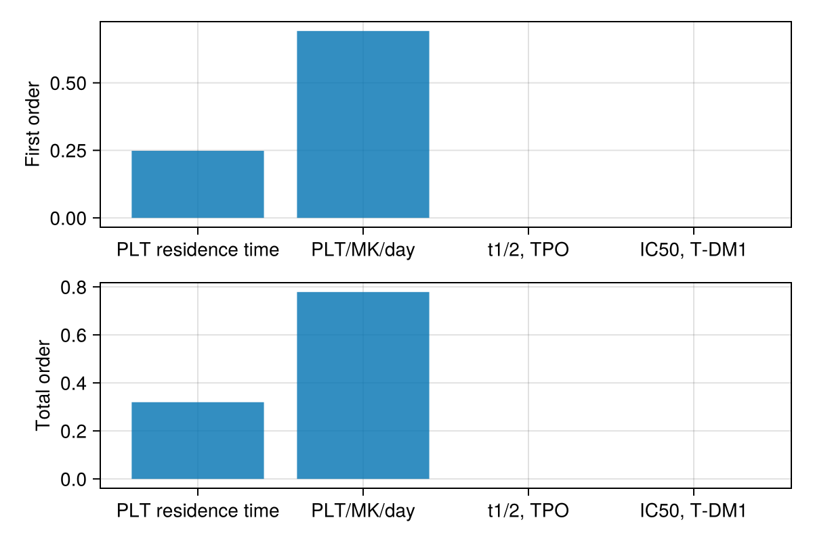

# Thrombocytopenia(TCP) from ADC

The model is summarized in the following diagram. 

Abbreviations used in the final model: 
- CFU-MK: colony forming unit megakaryocyte
- MK: megakaryocyte
- TPO: thrombopoietin
- T-DM1: Trastuzumab emtansine

The file that coded for model above is [`model/platelet_dynamics_simp_tdm1.jl`](model/platelet_dynamics_simp_tdm1.jl). 

Comparison of simulated and observed T-DM1 induced thrombocytopenia (TCP) as produced in [`script/platelet_tdm1_indiv.jl`](script/platelet_tdm1_indiv.jl). 

## Development of platelet differentiation model 

The model was built in a step-wise fashion: 

1. the base model was adopted from ABM poster. This base model include the differentiation from LT-HSC to MK, and the platelet production (by MK) and death. 

2. Develop the relationship between TPO promoting CFU-MK division. This was achieved using data obtained from [Broudy et al., 1996](https://pubmed.ncbi.nlm.nih.gov/8822921/). 

3. Develop the relationship between platelet number and TPO concentration using data from [Engel et al., 1999](https://pubmed.ncbi.nlm.nih.gov/10354155/). 

4. Integrate and simplify the platelet production model. 

5. Develop relationship between T-DM1 impact on CFU-MK. This was achieved by using data from [Uppal et al., 2015](https://pubmed.ncbi.nlm.nih.gov/25370470/). 

6. Simplify T-DM1 PK obtained from [Scheuher et al., 2023](https://link.springer.com/article/10.1007/s10928-023-09884-6). 

7. Integrate T-DM1 PK and simplified platelet production model. 

### Implementation of base model 

The prior version of this model was implemented and verified in [this Github repo](https://github.com/metrumresearchgroup/2023-ACoP-14-gene-therapy). Amplification round and mean residence time were incorporated as the AMB poster suggested in Figure 1. 

Abbreviations used in the base model: 
- LT-HSC: long term-hematopoietic stem cells
- ST-HSC: short term-hematopoietic stem cells
- MPP: multi-potent progenitor cells
- CMP: common myeloid progenitor cells
- BFU-MK: burst forming unit megakaryocyte
- CFU-MK: colony forming unit megakaryocyte
- MK: megakaryocyte
- TPO: thrombopoietin

<figure class="image">
  
  <figcaption>Figure 1. ABM model diagram</figcaption>
</figure>

The model was coded in `model/dynamics_noTPO.jl` and tested in `script/steadystate_noTPO.jl`. 

### Relationship between TPO and CFU-MK division

The relationship between TPO promoting CFU-MK division was fitted based on data from [Broudy et al., 1996](https://pubmed.ncbi.nlm.nih.gov/8822921/). Despite the data was obtained from murine CFU-MK, we assumed that the relationship between TPO promoting CFU-MK division was conserved between species. The relationship was assumed to be logarithmic (based on observation) and was fitted accordingly (Figure 2).

<figure class="image">
  
  <figcaption>Figure 2. relationship on TPO-promoting CFU-MK division</figcaption>
</figure>

The final fitted relationship between CFU-MK amplification number and TPO concentration in murine CFU-MK in culture was `aCFUMK = aCFUMK0 * log(2.73 + beta2 * TPO) / log(1.38)`, where `aCFUMK0 = 66.6`, `beta2 = 0.24`. The fitting was carried out in `script/TPO_CFU_MK_fitting.jl`. 

### Relationship between platelet and TPO

The relationship between platelet number and TPO level was assumed to be exponential ([Engel et al., 1999](https://pubmed.ncbi.nlm.nih.gov/10354155/)). The exponential relationship was fitted based on Figure 3 of [Engel et al., 1999](https://pubmed.ncbi.nlm.nih.gov/10354155/). The final relationship for TPO synthesis rate is `ksynTPO = exp(alpha1 - beta1 * p)`, where `p` is the blood platelet concentration (*1E9/L), with `alpha1 = -4.34`, `beta1 = -0.009`. The fitting was carried out in `script/TPO_CFU_MK_fitting.jl`. 

### Integrate platelet, TPO, and CFU-MK feedback into the base model 

During the integration, some additional parameters that were obtained from literature but not shown on the model diagram: 

- TPO half life was assumed to be 1.25 days ([Kurzrock, 2003](https://www.ncbi.nlm.nih.gov/books/NBK12518/)).
- Platelet mean residence time was assumed to be 7-10 days ([Josefsson et al., 2020](https://www.ncbi.nlm.nih.gov/pmc/articles/PMC7589436/)). 
- Platelet production per MK cell per day was assumed to be between 480 and 600 ([Patel et al., 2005](https://www.ncbi.nlm.nih.gov/pmc/articles/PMC1297261/)). 

The model is coded in `model/platelet_dynamics_TPO1.jl`. Additional optimization was carried out to incorporate TPO and platelet feedback on the model. These optimization was carried out due to lack of knowledge in TPO synthesis and platelet production by MK. The final simulated steady state of the model was aimed to capture platelet number, MK number, and TPO concentration in the literature range (Table 1). 

<table>
Table 1. Steady state comparison. 
  <tr>
    <th>Variable</th>
    <th>Numbers</th>
    <th>Ref</th>
  </tr>
  <tr>
    <td>Platelet</td>
    <td>2.59E11/L</td>
    <td>130E9/L and 332E9/L (<a href="https://www.ncbi.nlm.nih.gov/pmc/articles/PMC4339937/">Singh et al., 2015</a>)</td>
  </tr>
  <tr>
    <td>TPO</td>
    <td>3.17E-3 nM </td>
    <td> 2.13E-3 and 6.25E-3 nM (<a href="https://www.ncbi.nlm.nih.gov/pmc/articles/PMC4339937/">Singh et al., 2015</a>)</td>
  </tr>
  <tr>
    <td>MK</td>
    <td>3.86E8</td>
    <td>1.2E8 (<a href="https://pubmed.ncbi.nlm.nih.gov/1060175/">Branehög et al., 1975</a>)</td>
  </tr>
</table>

Optimization was carried out in `script/troubleshoot_TPO1.jl`

### Simplify the platelet development model 

To simplified the platelet development, we focus on the steps after CFU-MK cells, since they are the cells would be impacted by T-DM1. Thus the BFU-MK -> CFU-MK was replaced with a steady influx. The model was coded and tested in `script/platelet_dev_simplified.jl`.

### Development of in vitro model for the impact of T-DM1 on megakaryocytes

The data was obtained from [Uppal et al., 2015](https://pubmed.ncbi.nlm.nih.gov/25370470/). Based on this paper, we made follow assumptions: 

- T-DM1 mainly impact CFU-MK -> MK differentiation 
- FcRγ-II was overly abundant in CFU-MK or its progenitor cell surface compared to T-DM1 level (i.e. uptake of T-DM1 would be happening at a constant rate)
- Trastuzumab have no inhibitory impact on CFU-MK cells (i.e. all drug effect were coming from T-DM1)
- Accumulative T-DM1 directly impact the amplification of CFU-MK. 

<figure class="image">
  
  <figcaption>Figure 3. in vitro model diagram</figcaption>
</figure>

The inhibition of T-DM1 on CFU-MK amplification was described by a Hill equation (assumed). 

The optimized results for control group and T-DM1 treated group in cell culture is shown in Figure 4. 

<figure class="image">
  
  <figcaption>Figure 4. in vitro model for T-DM1 impact on CFU-MK</figcaption>
</figure>

This optimization was carried out in `script/tdm1_mk_simp.jl`. 

### Implementation of simplified T-DM1 PK

T-DM1 PK model was a two-compartmental PK model obtained from [Scheuher et al., 2023](https://link.springer.com/article/10.1007/s10928-023-09884-6) and simplified by dropping HER2-expressing cells in central and peripheral compartments, tumor, and modulated distribution of ADC and sHER2:ADC distribution between compartments. The simplified model can capture the T-DM1 PK especially well for the approved dose (3.6mg/kg) (Figure 5).

<figure class="image">
  
  <figcaption>Figure 5. T-DM1 PK fitted result</figcaption>
</figure>

The PK implementation was carried out in `script/tdm1_pk.jl`.

### Combined model simulation

The combined model assumed that T-DM1 in the CFU-MK is the same as the one in bone marrow. The partition coefficient between bone marrow and plasma of T-DM1 (i.e. central compartment) was assumed to be 0.07 ([Hosseini et al., 2020](https://www.nature.com/articles/s41540-020-00145-7)). The simulation from the combined model is shown in Figure 6. The platelet count changes with the T-DM1 concentration in plasma  (simulated in `script/platelet_tdm1_simp.jl`). With the change of T-DM1 concentration, platelet number in the blood oscillates in sync with T-DM1 plasma concentration.  

<figure class="image">
  
  <figcaption>Figure 6. T-DM1 PK and simulated platelet count</figcaption>
</figure>

Note the minimal platelet count showed up ~ 9 days after dosing, close to the 8 days reported in [Girish et al., 2012](https://www.ncbi.nlm.nih.gov/pmc/articles/PMC3337408/). 

With parameter tuning on platelet residence time, platelet production rate by MK per day, and IC50 of T-DM1 on CFU-MK, simulation results can match up with individual patient observations reported in [Krop et al., 2010](https://ascopubs.org/doi/10.1200/JCO.2009.26.2071) (Figure 7)  (simulated in `script/platelet_tdm1_indiv.jl`).

<figure class="image">
  
  <figcaption>Figure 7. Simulated platelet count vs observed platelet count</figcaption>
</figure>

## Sensitivity Analysis

The following parameters were included in the sensitivity analysis: 
1. platelet (PLT) residence time. This value varies between 3-12 days (McGirr et al., 2022, [Williams and Sergent, 2022](https://www.ncbi.nlm.nih.gov/books/NBK557800/)).   
2. platelet production rate by MK (PLT/MK/day). This value varies between 240 and 10000 ([Wang and Zheng, 2016](https://www.ncbi.nlm.nih.gov/pmc/articles/PMC4914488/)).  
3. TPO half life. This varies between 0.83 - 1.66 days ([Kuter et al., 2023](https://medilib.ir/uptodate/show/6673)). 
4. T-DM1 IC50 on CFU-MK cells. This value varies between 2-50nM ([Uppal et al., 2015](https://pubmed.ncbi.nlm.nih.gov/25370470/)).

A global sensitivity is carried out in `script/GlobalSens_platelet_tdm1.jl`. Platelet production rate by MK was estimated to have the most significant impact on platelet number. 

<figure class="image">
  
  <figcaption>Figure 8. Global sensitivity analysis on platelet count</figcaption>
</figure>

## Dose effect on TCP

High dose of T-DM1 (4.8mg/kg) was reported to cause grade 4 TCP as reported in [Girish et al., 2012](https://www.ncbi.nlm.nih.gov/pmc/articles/PMC3337408/). This was captured in the simulation shown in Figure 9 (in `script/Alt_dose_tdm1.jl`). In the same simulation, low baseline platelet count was also shown to associate with higher grade of TCP. 

<figure class="image">
  
  <figcaption>Figure 9. Dose effect on platelet count</figcaption>
</figure>

## Extending the model beyond T-DM1

The main difficulties of extending this TCP model beyond T-DM1 was the lack of knowledge in how ADC impact platelet production. As pointed out by [Kuter 2015](https://pubmed.ncbi.nlm.nih.gov/25952492/), there are many mechanisms for chemotherapy-induced thrombocytopenia. Thus, the mechanism for ADC-induced TCP may be payload dependent. Furthermore, additional studies for the toxicity (i.e. IC50) for ADC on MK cells or its progenitor may be needed for further model development. 
